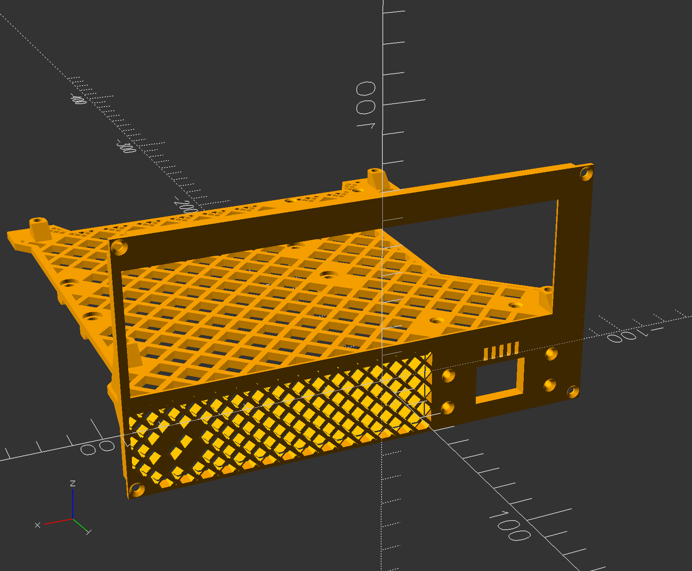
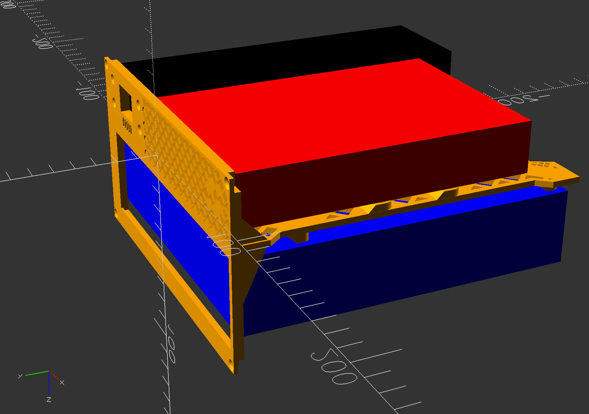

# Game of Life ITX Case — ITX Layout Study



A parametric OpenSCAD model built around the ["4.7L Mini ITX case, easily
printable (2 major pieces)"](https://www.printables.com/model/143897-47l-mini-itx-case-easily-printable-2-major-pieces)
design. The original case pairs a fish-shaped **spine** (structural divider +
motherboard standoffs) with an outer **shell**. This project keeps the
spine's general "sandwich" concept — a divider plate between a motherboard
compartment and a GPU/PSU compartment — but redesigns the lower compartment
around a different hardware set:

- **GPU → 3.5" HDD**, mounted via damping/grommet screws
- **Standard ATX/FlexATX PSU → HDPLEX 250W GaN AIO ATX PSU**

The outer shell itself has not been redesigned yet — this file is a layout
and mounting study for the spine only.

## Files

| File | Purpose |
|---|---|
| `game_of_life_itx_case.scad` | The working model — everything described below. |
| `basic_layout.scad` | An early snapshot, kept for reference. |
| `4.7-Fish_-_spine.stl` | Original spine reference geometry (source: printables.com link above). Its front I/O opening dimensions, retention-groove geometry, mounting-hole layout, and outer-edge taper shape were all measured from this file; the new spine is otherwise built from scratch. |
| `4.7-Fish_-_case.stl` | Original outer shell reference geometry — not yet used in the model. |
| `4.7-fish-step.step` | Original design in STEP format. |

## Using this file

- Requires OpenSCAD **≥ 2019.05** (uses `offset()`, needed for the divider
  plate's lightening pattern).
- `used_components = false` near the top of `game_of_life_itx_case.scad` toggles
  `SHOW_MB`/`SHOW_HDD`/`SHOW_GAN_PSU` together — flip it to `true` to show
  translucent reference boxes for the actual hardware footprints alongside
  the printed geometry, useful when checking clearances. Leave it `false`
  for a clean export.
- `SHOW_SPINE` / `spine_ref()` imports the *original* reference STL
  (translated/rotated to a comparison pose) — this is how nearly every
  "real" measurement in this file was taken (DXF projections and
  cross-sections through it; see the Conventions section below). It's not
  part of the printed model and should stay `false` unless you're
  re-measuring something against the reference.
- `SHOW_ODD` / `ODD_SIZE` / `ODD_POS` is a leftover placeholder for a slim
  optical drive that was considered early on and never integrated — it's
  not wired into `new_spine()` at all, just a floating reference box. Safe
  to ignore or delete; it doesn't affect the real model.
- To export a printable STL: set `SHOW_NEW_SPINE = true`, everything else
  (`SHOW_SPINE`, `SHOW_ENCLOSURE`, `SHOW_ODD`, `used_components`) `false`,
  then **F6 (Render)** before exporting — not F5 (Preview). The divider
  plate's honeycomb/diamond lightening pattern in particular is slow
  and can render incorrectly in Preview; always confirm on a full Render.
- After changing any parameter, **check the console output for `WARNING:`
  lines** before trusting the result — see Conventions below.

## Conventions

Ground rules this project has settled on, worth knowing before changing
anything:

- **Real hardware numbers and free/adjustable numbers are both allowed,
  but always labeled which is which.** Most dimensions here come from a
  verifiable source (a datasheet, a spec whitepaper, a manufacturer's own
  STEP file, or direct measurement off the reference STL) — comments say
  exactly where each one came from and how confident it is. Some
  parameters (taper `DEPTH`s, wedge geometry, lightening-pattern cell
  size) have no real-world reference and are intentionally free — those
  say so explicitly too. When a parameter defaults to a real-hardware
  value but is still meant to be freely adjustable (e.g. the taper
  `DEPTH`s), the model computes the real value at render time and
  **echoes a `WARNING:`** if your number has drifted from it, rather than
  silently accepting a mismatch or silently overriding your choice.
- **A manifold render does not mean the parts are actually connected.**
  OpenSCAD's `--render` "Top level object is a 3D object (manifold)"
  check only proves the *union* is watertight — a union of two
  individually-valid but spatially-disjoint solids still reports as
  manifold. This bit twice during development (a taper cutting a standoff
  loose from the plate; a wedge left floating past a panel edge) before
  the STL-intersection-probe method below became standard practice.
- **Verify real connectivity with STL-intersection probes, not just a
  render.** Export the model to STL, then `intersection()` it against a
  small probe cube at a specific coordinate in a throwaway scratch file:
  `openscad --render -o probe.stl probe.scad` where `probe.scad` is
  `intersection() { import("model.stl"); translate([x,y,z]) cube([s,s,s]); }`.
  `Current top level object is empty` at a point that should have
  material (or real vertex/facet output at a point that should be open
  air) means something is actually wrong, even if the full-model render
  reported no error. This is how every taper, wedge, and lightening-mode
  change in this file has been checked.
- **After changing any parameter, check the console for `WARNING:`
  echoes.** The file has several deliberate self-checks built in (taper
  `DEPTH` mismatches, MB-standoff disconnection risk from the -X taper,
  wedges skipped for lack of IO-groove clearance) — they only help if
  someone actually reads the console output after a render.
- **Naming convention**: `PX`/`NX`/`NY`/`PZ`/`NZ` prefixes/suffixes mean
  "which edge/side", not an arbitrary label — `PX` = +X edge, `NX` = -X
  edge, `NY` = -Y edge, and so on, used consistently across the plate
  tapers, the reinforcement wedges, and the IO groove widen parameters.
  `UPPER`/`LOWER` on the wedges means Z (toward the MB compartment or the
  HDD/GaN side), not X.
- **This part has a specific intended print orientation** (+Y face down,
  -Y "up") that isn't just a slicer setting — several design choices
  (standoff ramps, the lightening-pattern mode default) exist because of
  it. See "Print orientation" below before assuming a parameter choice is
  arbitrary.

## What's modeled



- **Divider plate**, shaped to match the reference STL's own outline (not a
  plain rectangle) — trapezoidal taper cuts on all 3 non-I/O edges, flush
  with the HDD standoffs on one side and the GaN PSU standoffs on another.
  Standoffs for the motherboard rise from the top face; HDD and GaN PSU
  standoffs hang from the underside.
- **Front panel reinforcement wedges** — 4 triangular gussets tying the
  (vertical) front panel to the (horizontal) divider plate at each of its
  4 corners, auto-anchored to the plate's real edge so they can't be left
  floating in open air if the taper parameters change later.
- **Front I/O panel, upper portion**: the motherboard's rear-IO cutout
  (real ATX-spec size, measured from the reference STL), plus its real
  two-depth **retention groove** (a snug collar the shield's face seats
  against, then a wider recessed pocket the shield's folded lip snaps
  into), plus 2 M3 corner mounting screws with shell-mating tab slots.
- **Front I/O panel, lower portion**: a GaN PSU power-cable opening, an HDD
  honeycomb/diamond ventilation grill, a small vertical-bar ventilation
  grill between the GaN cable cutout and the MB compartment, and 2 more M3
  corner mounting screws (matching the upper panel).
- **Divider plate lightening/ventilation pattern** — a honeycomb or
  45°-rotated "diamond" cutout pattern through the plate itself, switchable
  by a single parameter, with automatic clearance around every standoff and
  the plate's own tapered edges.
- **Standoff support ramps**: every standoff (MB/HDD/GaN) gets a 45°
  self-supporting print ramp fused to its +Y side, so the peg doesn't need
  print supports in this part's real print orientation (see below).
- **Pass-through screw access**: the HDD and GaN PSU standoffs hang below
  the plate where a screwdriver can't reach once the drive/PSU are
  installed. Screws for those two joints go in from the **motherboard side**
  instead — through an access hole in the plate, down through the standoff's
  bore, and directly into the HDD's/PSU's own tapped mounting hole.
- **HDD vibration isolation**: the HDD standoffs mount the drive through a
  pair of silicone O-rings per screw instead of a rigid plastic-to-metal
  clamp, so drive vibration doesn't couple straight into the plate (and
  from there, the rest of the case). See "HDD vibration isolation" under
  Hardware below for the real numbers and install instructions.

Most dimensions and hole patterns are pulled from real sources (datasheets,
official spec whitepapers, or — for the GaN PSU — the manufacturer's own
published STEP CAD file) rather than guessed. See the comments in
`game_of_life_itx_case.scad` for exactly where each number came from and how confident
it is; a few (the GaN PSU's front-panel cable/mount cutout, most notably)
are explicitly flagged as simplified placeholders, not verified hardware.

## Print orientation

This part is intended to print with the spine's **+Y face down on the
build plate**, build direction running **+Y → -Y** — i.e. **-Y is "up"**
from the bed's perspective, not the model's own Z axis. This isn't just a
slicer setting; several design decisions in the model exist *because* of
this orientation, and would need re-checking if you ever print it flat
(Z-up) instead:

- **Standoff bodies** (the MB/HDD/GaN pegs) are built along the model's Z
  axis, which is **horizontal** in this orientation — a bare peg would be
  a horizontal cantilever with nothing under it as it printed outward. The
  45° `standoff_ramp()` fused to each peg's +Y side solves this: material
  builds up gradually layer-by-layer *ahead* of the peg's own mass arriving,
  instead of the peg overhanging with no lead-in. `STANDOFF_RAMP_RUN_FACTOR`
  controls the ramp's slope (1.0 = 45°, self-supporting). Built as two
  `hull()`s: the first blends the round peg into a flat, constant-width bar,
  the second tapers that bar's height down to flush with the plate over `run`.
- **Standoff/plate screw holes** (MB + GaN M3 bores, HDD 6-32 bore) are
  likewise Z-axis, so also horizontal in this orientation — but all of
  them are small enough (3.8–4.6mm diameter) to self-bridge cleanly
  without dedicated supports. (There's no O-ring pocket anymore — see
  "HDD vibration isolation" / "GaN PSU thermal isolation" below - the
  O-rings sit on flat standoff/plate faces instead.)
- **Front panel screw holes** (corner mounts) are
  cut with `rotate([-90,0,0])`, putting their axis along Y — which is
  **vertical** in this orientation. These print as plain round holes with
  zero overhang concern regardless of size.
- **The divider plate's lightening pattern must avoid long straight walls
  aligned with X.** A layer at a given Y is an X-Z cross-section; any
  cutout-pattern wall that runs purely along X becomes a single print layer
  spanning the *entire plate width*, resting only on whatever narrow
  vertical struts happen to sit below it — a real, confirmed unsupported
  bridge. This is why `"honeycomb"` (zigzag walls) and `"diamond"`
  (45°-rotated grid, diagonal walls) are the only two lightening modes —
  neither has a wall segment running purely along X or Y. A plain
  axis-aligned grid was tried and dropped for exactly this reason: every
  row needed print supports in this orientation. See "Divider plate
  lightening pattern" below.

If you ever reorient this part to print flat (Z-up), none of the above
constraints apply.

## Technical reference

Parameter-level detail that's genuinely useful to have somewhere other than
inline comments — the comments in `game_of_life_itx_case.scad` are the authoritative
source for the *exact* current values and any edge-case caveats, but the
*why* behind each system is collected here so it isn't spread across
hundreds of scattered comment blocks.

### Divider plate position, size, and taper shape

`SPINE_PLATE_POS`/`SIZE` are plain, independent `[x,y,z]`/`[w,d,t]` numbers
— not live formulas — matching every other part's `POS`/`SIZE` in this
file. `SPINE_PLATE_MARGIN_X` applies an additional, separately-adjustable
X-only inset on top of those (shrinks the plate symmetrically, recentered);
`0` means the plate's real edges are exactly `POS`/`SIZE` as given. At the
current 0 margin, the plate's -X edge is flush with the front panel's own
-X edge, and its +X edge (before tapering) is flush with the HDD standoffs.

The plate's outline is **not a plain rectangle** — it copies the reference
STL's own trapezoidal taper on all 3 non-I/O edges (+X, -Y, -X), each
controlled by independent parameters:

| | `*_BEFORE` | `*_RUN` | `*_AFTER` | `*_DEPTH` |
|---|---|---|---|---|
| **+X** (`SPINE_PLATE_TAPER_PX_*`) | flat full-width run before the taper starts | Y-run of the taper itself | flat narrow run in the middle | X-depth of the indent, measured in from the front panel edge |
| **-Y** (`SPINE_PLATE_TAPER_NY_*`) | flat full-depth run before the taper starts | X-run of the taper itself | — (not exposed for this edge) | Y-depth of the indent, measured in from the plate's full back edge |
| **-X** (`SPINE_PLATE_TAPER_NX_*`) | flat full-width run before the taper starts | Y-run of the taper itself | flat narrow run in the middle | X-depth of the indent, into the plate from its -X edge |

`BEFORE` and `RUN` are mirrored from both ends of their edge (front/back or
left/right). All 3 `RUN` values were measured directly from the reference
STL's own outline (DXF projection); `BEFORE` values are free/adjustable
(no real reference — the reference STL doesn't have a "before" flat run at
all, it tapers immediately).

`AFTER` (+X and -X only) is the flat run at the narrow width, in the
middle of the edge — geometrically it's just what's left over once both
`BEFORE`s and both `RUN`s are accounted for
(`plate_d - 2*BEFORE - 2*RUN`), but rather than being computed as a
leftover, it's a real parameter: the back-side breakpoints are derived
from the front side's own breakpoints minus `AFTER`, not mirrored
independently from the plate's far edge. That means `BEFORE`/`RUN` still
apply identically from both ends, but the two tapers can end up an equal
distance from the plate's true center only if `2*BEFORE + 2*RUN + AFTER`
actually equals the plate's own depth — there's no enforcement of that,
same as everywhere else in this taper system (see `DEPTH`'s own drift
warnings below for the general philosophy). Each default value was set to
exactly reproduce what the old implicit-leftover version already built,
so introducing the parameter didn't move any geometry by itself.

`DEPTH` is where the +X/-Y tapers differ from -X: the +X taper's depth
defaults to whatever keeps it flush with the **HDD standoffs**, and the -Y
taper's defaults to flush with the **GaN PSU standoffs** — both are still
plain, independently-adjustable numbers (not live formulas), but
`new_spine()` computes the real flush value each render and **echoes a
warning** if your `DEPTH` has drifted from it (e.g. after moving
`GAN_PSU_POS` or `HDD_POS`). The -X taper's `DEPTH` has no single real
value to flush against, so there's no mismatch warning for it — but it has
a different safety check instead: pushing it too far can cut the plate's
-X edge back past an **MB standoff's own position**, disconnecting it from
the plate (this happened once during development). `new_spine()` checks
every MB standoff's own -X extent against the taper's real edge at that
standoff's Y and echoes a warning if the taper has eaten into it.

### Front panel reinforcement wedges

4 triangular gussets (right-triangle cross-section in the Y-Z plane,
extruded in X) tying the front panel to the divider plate at its 4
corners: `WEDGE_PX_UPPER`, `WEDGE_PX_LOWER`, `WEDGE_NX_UPPER`,
`WEDGE_NX_LOWER`. Naming: `PX`/`NX` = which plate edge it anchors to (+X
near the HDD standoffs, -X on the opposite side — same convention as the
taper parameters above); `UPPER`/`LOWER` = Z, reaching up toward the MB
compartment or down toward the HDD/GaN side.

Each wedge has independent `Y1`/`Z1`/`Y2`/`Z2`/`THICKNESS` — the
right-angle corner sits at `(Y1, Z2)`, the real physical corner where the
panel meets the plate. **X position is auto-anchored, not fully free**:
each wedge sits flush with the plate's real edge at whatever X that edge
is *at the wedge's own `Y2`* (via `spine_plate_px_edge()`/
`spine_plate_nx_edge()`), so it stays correctly attached even if the taper
parameters above change later — a plain fixed X would risk leaving the
wedge disconnected from the plate if a taper ever moved past it. Each
wedge also has an `X_OFFSET`, layered on top of that auto-anchor (same
pattern as `SPINE_PLATE_MARGIN_X`): `0` reproduces the flush position,
positive shifts toward +X, negative toward -X — regardless of which edge
the wedge is on. Push it too far and it either buries into the plate
(harmless) or pulls away from the real edge into open air (disconnects it)
— worth a render + connectivity check after changing it.

The two `UPPER` wedges additionally get their `Z1` clamped below the IO
shield retention groove's real, `MB_POS`-aware footprint (`io_groove_
bounds()`), so a moved MB can't leave a wedge anchored to panel material
the groove has since hollowed out. If there's no clearance left at all,
the wedge is skipped rather than built broken — watch the console for a
`WEDGE_*_UPPER skipped` warning.

### IO shield retention groove

Real, measured geometry (cross-sectioned from the reference STL, not
guessed): stock ATX IO shields are stamped steel with a folded-back
perimeter lip. The shield's flat face registers against a snug **collar**
(`FRONT_PANEL_IO_COLLAR_DEPTH`, exactly the nominal IO rectangle size,
`FRONT_PANEL_IO_OFFSET`), and that folded lip snaps into a **wider pocket**
recessed just behind it — like a picture frame's rabbet. The widen amount
is independent **per side** (`FRONT_PANEL_IO_GROOVE_WIDEN_NX/PX/NZ/PZ`),
not one shared number: 3 sides are at the real measured value (3.25mm),
but `PX` was intentionally reduced (to 1.25mm) early on to reclaim
clearance to the front panel's own outer edge.

The collar's own size (`FRONT_PANEL_IO_OFFSET`, 159.00 x 44.50mm) is
validated against the official **ATX Specification 2.01, Sec 3.3.5**:
nominal I/O cutout = 158.75 x 44.45mm (6.25in x 1.75in, ±0.20mm) — our
value is already within a hair of that (slightly larger, the safe
direction), so it was left alone.

A real print + assembly test showed the shield not fully seating on the
+X side, though — that turned out to be the `PX` groove widen, not the
collar. Recomputed the actual available margin at the current geometry
(panel edge at world x=93, groove reaching x=91.24 at the old 1.25mm)
and found room to grow it to **2.5mm** while still leaving a safe ~0.5mm
wall, closing most of the gap back to the real 3.25mm value. Re-check this
margin if `ENCLOSURE_SIZE`, `MB_POS`, or `FRONT_PANEL_IO_OFFSET` change.

### Motherboard front-to-back position (`MB_POS[1]`)

Validated against the official **Mini-ITX Addendum v2.0** (to the
microATX Motherboard Interface Specification) and the ATX spec's own
connector-placement rule, not guessed: mounting hole "C" sits 10.16mm in
from the board's rear/IO edge, and the ATX spec's Fig. 5 states the rear
I/O connector face sits 11.30mm from that same hole reference — i.e. the
real connector face sits **1.14mm beyond** the board's physical edge, not
flush with it.

Working through that against this model's own geometry: the old `MB_POS`
put the board's edge exactly at the front panel's inner face, which placed
the (spec-derived) connector-face plane 2.35mm behind
`FRONT_PANEL_IO_COLLAR_DEPTH` — i.e. behind where this design's own IO
groove treats "the shield's face" as sitting. A real print/assembly test
confirmed the board sat too recessed from the IO shield by about that
much. `MB_POS[1]` was moved from -90 to **-87.65** (+2.35mm, toward the
front panel) so the spec-derived connector-face plane lands on the collar
plane instead. Side effect: this ate the print clearance one of the
front-panel reinforcement wedges relied on — see `WEDGE_PX_UPPER` in
"Front panel reinforcement wedges" above; it's now skipped (with a console
warning) rather than built broken.

### Motherboard mounting holes (`MB_HOLES`)

Spec-derived, from the official **Mini-ITX Addendum v2.0** (Fig. 3/Table
3) - standard 4 holes C, F, H, J (reusing ATX/microATX's own naming),
datum at hole C = 6.35mm/10.16mm from the board's rear-left corner, the
other 3 following from the drawing's own dimensioned spans (C-F =
152.40mm/6.00in exactly, etc). Re-derived from scratch and triple-checked
directly against the primary-source dimensioned drawing itself (not just
a summary of it) - each number traced to a specific labeled dimension.

```
[-78.65,  74.84]  // hole C - spec datum
[ 73.75,  62.14]  // hole F
[-78.65, -80.10]  // hole H
[ 73.75, -80.10]  // hole J
```

(`+Y` here = toward the case front panel/IO edge, opposite the spec's own
`+Y`.)

This went back and forth once: after a print, these were briefly replaced
with a different, real-board-measured set (differing by up to ~9.6mm on
hole F) on the reasoning that a physically-tested fit beats an untested
spec derivation. But that "fit" turned out to require force and warp the
spine slightly - not actually a clean fit, just a fight the screws won.
Back on the spec values now. **Not yet print-tested at this exact
revision** - re-check fit on the next print, and if a real board's
standoffs still don't land cleanly, that's a real signal to re-measure
the physical board rather than trust the spec blindly (some boards do add
non-standard holes beyond the form factor's minimum).

### Divider plate lightening pattern

`SPINE_LIGHTENING_MODE` (`"honeycomb"` or `"diamond"`) selects between 2
interchangeable cutout patterns through the plate's own Z thickness — same
idea as the HDD grill, but cut through the structural divider plate instead
of a thin panel. A plain axis-aligned `"grid"` mode existed early on and
was removed - see "Print orientation" above for why (every row would have
needed print supports in this part's real orientation).

**Where the pattern stops** is independent per side —
`SPINE_LIGHTENING_MARGIN_PX/NX/PY/NY` (PX/NX/NY = same edges as the taper
params; PY = the plate's plain, untapered +Y edge). Each is a real,
independent limit, not layered on a shared floor: any of the 4 can go down
to 0, or negative (letting the pattern reach past that edge, which the
plate's own real outline then naturally clips), with no minimum enforced.

That freedom is safe specifically because of *how* the margin is applied:
as a plain axis-aligned box, not an `offset()` of the plate's own outline.
That distinction matters for a real reason — an earlier version confined
the pattern with a uniform `offset()` of the taper-notched outline, and the
plate's 4 reflex (concave) taper-notch corners turned out to be numerically
touchy: a diamond/grid line running close to one of those corners could
leave a razor-thin sliver hole breaching all the way through the plate.
That turned out to be a numerical artifact of running OpenSCAD's `offset()`
against those specific corners — not a "needs N mm of clearance" issue —
so a plain box, which never calls `offset()` at all, sidesteps it entirely
(confirmed clean at all 4 corners even with every margin pushed down to 5).
**If you ever reintroduce an outline-following `offset()` here, re-verify
all 4 corners with a full render (F6), not just Preview** — a
STL-intersection probe at each corner is the most reliable check.

`SPINE_LIGHTENING_MARGIN_PX/NX/NY` each follow their own taper's real edge
(`spine_plate_px_edge_points()`/`nx_edge_points()`/`ny_edge_points()`)
instead of a flat line, staying a constant distance from that taper's
actual shape through its notch, and automatically re-tracking it if the
corresponding `SPINE_PLATE_TAPER_*` params are ever retuned. `PY` stays a
flat line — the plate's own +Y edge isn't tapered, so there's no real edge
shape for it to follow.

**Every MB/HDD/GaN standoff keeps the pattern off itself and its
print-support ramp** — not a plain keepout circle. This part prints **+Y
face down**, so each standoff's ramp (see "Print orientation") needs real
solid material to land on where it touches the plate, not just clearance
around the peg. Every pattern cell is tested against the standoff's real
footprint — the peg's own circle *and* its ramp's rectangular reach — and
left un-cut (solid) if it overlaps, rather than just trimmed at the edge.
OpenSCAD has no way to query "did this boolean produce empty geometry" as a
condition, so this isn't a CSG operation at all: `grid_2d()` and
`honeycomb_2d()` (`game_of_life_itx_case.scad`) compute each cell's position with plain
trigonometry (matching whatever rotation/translation the caller is about to
place the tiling with) *before* generating it, and skip cells whose center
comes within `apothem - SPINE_LIGHTENING_STANDOFF_PROTECT_FUDGE` of the
footprint — `apothem` being that cell's own guaranteed-solid inradius, so
the test only needs a plain point-to-shape distance, not real polygon
intersection. `standoff_lightening_protect()` builds one part's footprint
list; `new_spine()` calls it once per part (MB/HDD/GaN) and concatenates
the results.

That function also drops any standoff whose whole footprint already falls
outside the margin box on one side — already guaranteed solid by the flat
margin there, so the per-cell test doesn't need to touch it too. Without
this, a standoff sitting in (say) the `PX` rim could still trigger the
per-cell test right at the margin's own boundary, leaving a small stray jog
in what should be a clean straight edge — confirmed by a facet-count diff
between the two, not just eyeballing it, since the artifact was small
enough to miss in a tight crop.

`SPINE_LIGHTENING_STANDOFF_PROTECT_FUDGE` (default 0.3mm) tunes the
per-cell threshold: 0 protects a cell the moment it *could* touch the
footprint at all; positive tolerates that many mm of encroachment first
(e.g. to not bother filling in a cell over a fraction-of-a-mm sliver);
negative protects even on near-misses. This deliberately isn't efficient —
the whole cell gets kept solid, not just the overlapping sliver of it, so
the result reads as clean, full diamonds/hexes/squares around every
standoff rather than tiny fragments.

**The row of "diamond"-mode cells nearest the -Y margin gets subdivided**
instead of left full-size (`SPINE_LIGHTENING_NY_INLAY_SCALE`, default 0.4;
0 disables it and reproduces a plain uniform grid). A full-size diamond
straddling the NY margin/taper boundary gets sliced by the clip into a
large, awkward partial shape — hard to print cleanly. Any cut-out
(non-protected) cell whose own circumscribed radius could reach that real,
taper-following boundary line gets replaced with a smaller self-similar
`grid_2d()` tiling at `INLAY_SCALE` (both cell size and wall scale
uniformly) instead of one big square — so if it does get clipped, only a
small diamond is cut in half, not a full-size one. This only ever applies
inside the branch that already decided a cell is a real cut-out; protected
(standoff) cells are never touched by it. Only `"diamond"` mode has this —
`honeycomb_2d()` doesn't take these params.

| Mode | Cell size params | Tradeoff |
|---|---|---|
| `"honeycomb"` | `SPINE_HONEYCOMB_HEX_R`, `SPINE_HONEYCOMB_WALL` | Best airflow/weight savings per unit wall thickness; slowest to print (many small islands = many perimeter loops + travel moves). Zigzag walls, no support issue in the real print orientation. |
| `"diamond"` (default) | `SPINE_GRID_SLOT_W/H`, `SPINE_GRID_WALL` | A plain square grid (`grid_2d()`), rotated 45° so no wall runs purely along X or Y (every one is a short diagonal) — no support needed in the real print orientation. Fewer, bigger cells than honeycomb at the same wall thickness. **Recommended default.** |

### Hex/grid tiling helpers (`honeycomb_2d()`/`grid_2d()`)

Both (used by the divider plate pattern above and the HDD grill below)
share the same shape: an oversized virtual field of cells, intersected
against a `[w,h]` rectangle for a clean straight border, rather than
clipping individual cells at the boundary.

`honeycomb_2d()` tiles on an enlarged virtual hex radius
(`r_tile = hex_r + wall/√3`) and cuts the smaller real `hex_r` inside each
tile — shrinking each of two hexagons sharing a tiling edge by half the
wall thickness opens a gap of exactly `wall` between them everywhere, not
just along one axis, which is why the tiling radius isn't simply
`hex_r + wall`. `grid_2d()` skips this trick — a square grid's wall
thickness is already uniform on a plain `(slot_w + wall)` pitch.

`honeycomb_2d()` generates hexes via `circle($fn=6)` at angle 0 (flat-top,
pointy left/right), which tiles with alternating **columns** offset
vertically by half a row — not alternating rows offset horizontally, the
other hex orientation's tiling.

Both take the same `protect_pts`/`protect_rects`/`protect_fudge`/
`world_rot`/`world_translate` params — see "Divider plate lightening
pattern" above for what they do; `world_rot`/`world_translate` only exist
to map each cell's local center into the same world space the protect data
was computed in (defaults leave the tiling a plain, unprotected shape).

`grid_2d()` additionally takes `inlay_edge_pts`/`inlay_scale` (see the -Y
row subdivision described above). `point_seg_dist()`/`point_polyline_dist()`
give the world-space distance from a cell center to that boundary polyline,
the same "how close is this cell to X" idea as `lightening_protect_dist()`
but against a line instead of circles/rects. When a cell is close enough
(within its own circumscribed radius of the line), `grid_2d()` calls itself
once to tile that cell's own `[slot_w,slot_h]` footprint with smaller
`inlay_scale`-sized cells instead of emitting one square — no separate
subdivision primitive needed.

### HDD ventilation grill (front panel)

`HDD_GRILL_MODE` (`"honeycomb"` or `"diamond"`) picks the pattern.
`HDD_GRILL_POS`/`HDD_GRILL_SIZE` place and size the grill directly and are
**untethered** from `HDD_POS`/`HDD_SIZE` — move or resize the vent
rectangle on the front face without it tracking the drive. (Their defaults
reproduce the old HDD-tethered footprint at the drive's current position,
so nothing shifted when this was untethered.) `HDD_GRILL_WALL` is the wall thickness for **either**
mode; cell size is per-mode: `"honeycomb"` uses `HDD_GRILL_HEX_R`,
`"diamond"` uses its own independent `HDD_GRILL_DIAMOND_SLOT_W/H` (not
tied to the divider plate's `SPINE_GRID_SLOT_W/H` — this grill isn't
structural, so it can run a finer/coarser pattern than the plate) via a
plain rotated `grid_2d()`, oversized then clipped to the grill's own
`[grill_w, grill_h]` rectangle the same way `new_spine()` clips its own
diamond field. `FRONT_PANEL_CORNER_INFILL_X/Z` cuts a guard wedge out of
the pattern itself (either mode) near the +X/-Z corner screw, guaranteeing
solid material around that screw regardless of where the
tiling's walls happen to land.

**`"diamond"` mode only:** up to 4 independent shapes are kept solid
(uncut) on the grill — decorative, not structural or airflow-related.
Each slot is a `[SHAPE, ANCHOR]` pair, `GOL_Grill_1_SHAPE`/
`GOL_Grill_1_ANCHOR` through `_4_`. Set `SHAPE` to `GOL_OFF` to turn that
slot off explicitly (this is the intended way - `ANCHOR = []` also
disables a slot, kept only so an old anchor value can be commented out
without touching `SHAPE`). Otherwise `SHAPE` is one of the patterns below
(`[di,dj]` live-cell offset lists, defined just above `HDD_GRILL_MODE`).

`LIFE_*` are silhouettes of the named Game of Life still lifes, not exact
copies: `LIFE_BLOCK` (2×2, simplest - a solid square, so it's the one
exact copy, already fully edge-connected on its own), `LIFE_BEEHIVE`
(hexagonal, 10 cells), `LIFE_POND` (12 cells, a square ring/"0"). The
real BEEHIVE/POND still lifes rely on diagonal (Moore) adjacency for
their Game of Life stability, which - like the arrows below - only
touches at a single corner point once rendered as solid grid cells, not
a full edge, and reads as a thin, weak pinch there rather than a joined
shape. BEEHIVE/POND each have one bridge cell added at every such
diagonal junction (toward the shape's *outside*, not into its hollow) so
every cell shares a full edge with its neighbor; this means they're no
longer verified-stable if actually simulated, but the added cells keep
the silhouette recognizable while making it print/render as one solid,
clearly joined shape rather than corner-connected fragments.

`LIFE_HEX_RING` (6 cells) is BEEHIVE's own hex outline again, but this
time deliberately left *without* the bridge cells - a second, hex-shaped
"0" distinct from POND's square one. It keeps the thin corner-touch
joints described above (a deliberate choice for this shape, not an
oversight); everywhere else on this grill favors the bridged/joined
version, so treat this one as the exception if you're looking for a
model of "how not to do it."

`ARROW_*` are **not** still lifes or any real Life
pattern — just plain `>`/`<` chevrons for decoration: two straight
index-space lines, one along each grid axis, sharing a corner cell.
`grid_2d()`'s cells are already tiled on a 45°-rotated square lattice, so
a plain straight run of cells along either axis *already* renders as a
diagonal line of diamonds once rotated — no diagonal stepping needed in
the index data itself. Two such lines meeting at a shared corner render
as two diagonal lines meeting at a clean point, i.e. a chevron, with the
corner cell keeping them solidly joined (every cell in each line shares a
full edge with its neighbor, not just a corner touch). `ARROW_GT_2`/
`ARROW_LT_2` have 2-cell arms (5 cells total, including the shared
corner); `ARROW_GT_3`/`ARROW_LT_3` have 3-cell arms (7 cells total).

Only slot 1 (`LIFE_HEX_RING`, +X side) is currently active; slots 2-4 are
off. Every other `LIFE_*`/`ARROW_*` pattern is still defined and
available - set any `GOL_Grill_N_SHAPE` to one of them to use it. This
changes often during tuning - treat the code's own `GOL_Grill_*` values
as the source
of truth over this paragraph if they ever disagree.

`ANCHOR` is a `grid_2d()` lattice index `[i0,j0]` in the *pre-rotation*
square grid — adjacency there is what Game of Life actually cares about,
the 45° rotation "diamond" mode applies is just a cosmetic render
transform on top, not a change to which cells are neighbors — with
lattice step `HDD_GRILL_DIAMOND_SLOT_W/H + HDD_GRILL_WALL`. The default
anchors were each picked by rotating a target on-grill position back into
that lattice (pond +X side, loaf -X side, the two arrows spread across
the center) and rounding to the nearest index; expect to iterate by trial
render if you move one, since the index space isn't the same as the
rendered space, and check the *whole* shape's extent, not just its
anchor corner — a shape whose corner is safely on-grill can still have
cells further out that land past the grill's real edge, where there's no
hole to protect in the first place (silently doing nothing there rather
than erroring), which is exactly the kind of thing a facet/genus-count
diff against a known-good render (see "Divider plate lightening pattern"
above for why that's the reliable check) will catch and eyeballing won't
always. Implementation: `life_pattern_protect_pts()`
(`game_of_life_itx_case.scad`) converts a still life's `[di,dj]` live-cell offsets
into zero-radius world-space `protect_pts` at exactly those cells' real
rendered positions — reusing `grid_2d()`'s existing standoff-protection
mechanism (see "Divider plate lightening pattern" above) to leave
precisely those cells solid, nothing more. The 4 slots are collected into
one list and flattened with a single list comprehension in
`front_panel_lower()` — trivial to extend to a 5th slot if wanted.

### Front panel ventilation grill (MB ↔ GaN PSU airflow)

A separate small row of vertical bars (`FRONT_VENT_POS/SIZE`,
`FRONT_VENT_SLOT_W`, `FRONT_VENT_WALL`) cut straight through the **front
panel's** Y thickness — not the divider plate — sitting in the one clear
strip of solid material between the GaN PSU's cable cutout and where the
upper panel piece begins. Placement is pinned to `GAN_PSU_POS` and the
plate's own Z position; re-check clearance if either moves.

## Hardware / screws needed

Two different thread standards are used in this build — **M3** everywhere
except the HDD, which uses the drive industry's standard **6-32 UNC**
(imperial, not metric). Don't mix them up when buying screws.

| Joint | Qty | Thread | Length | Head | Notes |
|---|---|---|---|---|---|
| Motherboard → standoffs | 4 | M3 | ~6mm | pan/socket | Standard mITX standoff screw length. The standoffs themselves are printed plastic with a plain clearance bore — they need **M3 heat-set threaded inserts**, or M3 thread-forming ("PT"/plastic) screws, since there's no metal thread to bite into. |
| HDD → standoffs (from MB side) | 4 | **6-32 UNC** | 3/8" (9.53mm)† | pan/button (flat underside) | Threads directly into the drive's own tapped bottom-mount holes. Vibration-isolated (see below) — the screw touches nothing but the two O-rings and the drive's threads the whole way through the plate and standoff. **Not** flat/countersunk — a countersunk head has no flat face to compress an O-ring evenly against. |
| HDD standoff isolation O-rings | 8 | — | AS568-007 (ID 0.145"/3.68mm, OD 0.285"/7.24mm, CS 0.070"/1.78mm) | silicone (VMQ), 70A | Two per standoff — one under the screw head, one between the standoff and the HDD's mounting boss. This is what actually isolates HDD vibration from the plate; the screw and standoff themselves never touch each other rigidly. See "HDD vibration isolation" below for install compression. |
| GaN PSU → standoffs (from MB side) | 4 | M3 | 16-18mm‡ | pan/socket (flat underside) | Threads directly into the PSU's own tapped mounting holes (verified from HDPLEX's STEP file, "same as HDPLEX 200W ACDC / 400W ACDC" pattern). Same access-from-above arrangement as the HDD. **Not** flat/countersunk — same reason as the HDD: needs a flat face to compress an O-ring evenly. |
| GaN standoff isolation O-rings | 8 | — | 5/32" ID × 9/32" OD × 1/16" CS (ID 3.97mm, OD 7.14mm, CS 1.59mm) | silicone, 70A | Two per standoff — one under the screw head, one between the standoff and the PSU's aluminum body. A **thermal** break (the GaN PSU's case runs meaningfully warmer than PETG's heat-deflection point under sustained load), not vibration isolation like the HDD's — see "GaN PSU thermal isolation" below. |
| Front panel → case shell (all 4 corners, upper + lower) | 4 | M3 | TBD | flat/countersunk, 90° | Attaches the spine assembly to the outer case shell. Each hole also has a shell-mating tab slot cut into the panel's inside face — the eventual shell gets a matching tab that this same screw clamps in place. Length depends on the shell's own screw boss depth, which hasn't been designed yet. |

**HDD hole pattern note:** an initial read of the Seagate Exos X16/X18/X20
manuals' mounting-configuration drawing (Figure 4) mis-chained the two
dimensions as two independent offsets from the same edge (41.28mm and
76.20mm from one edge, ~35mm apart) - that didn't match a real printed
test against an actual Exos drive at all. Re-reading the drawing at high
resolution (SATA X20 manual Rev. B, p.23) showed the two dimensions are
actually chained: `HDD_HOLE_Y_SATA_OFFSET` (SFF-8301 A7, "2X 1.625in" =
41.28mm) is measured from the connector-end edge to the near hole row, and
`HDD_HOLE_Y_SPACING` (SFF-8301 A13, "2X 3.000in" = 76.20mm) is the
hole-to-hole spacing between the two rows, not a second offset from that
same edge. That gives a far-hole-row offset of 146.99 − (41.28 + 76.20) =
29.51mm from the opposite edge - matching a real tape-measure check against
the physical drive (~1"/~1.5") almost exactly, so this is now the trusted
manual-sourced value, not a hand-measured placeholder.
`HDD_SATA_FACING_NEG_X` picks which world direction (±X) the connector end
faces, swappable and currently defaulted to −X; it assumes the current
`HDD_ROT = [0,0,90]` and should be re-checked against `rot2d()` if that
rotation ever changes.

† A real stack-up calculation, not a rule of thumb: plate thickness (3mm) +
standoff gap + ~3mm thread engagement (WD SFF-8301's own minimum) needs to
land exactly on a standard screw length. The HDD's own Z position
(`HDD_POS[2]` in `game_of_life_itx_case.scad`) was adjusted specifically to make that
land on 3/8" - the next standard size down (5/16") was rejected for
thread-engagement margin, and the next size up (7/16") pushes the drive
past the enclosure's own floor. (This was originally tuned assuming a
recessed O-ring pocket that no longer exists - see "HDD vibration
isolation" below - so there's now a little more margin than when this was
first derived, but 3/8" is still the right target.)

‡ Assumes ~4.5mm of M3 thread engagement into the PSU's aluminum body (a
general engineering guideline — the PSU's tapped-hole *depth* wasn't
extracted from the STEP file, only hole position and diameter), plus the
standoff run and plate thickness the screw passes through. Both O-ring
faces are now flat (no recessed pocket - see "GaN PSU thermal isolation"
below), so the screw head sits fully proud of the plate rather than
partially recessed - go with 18mm if the head looks tall, 16mm if it's a
low-profile one. Verify once real screws are in hand.

### GaN PSU AC inlet cutout (front panel)

`SHOW_GAN_CABLE` (default `false`, now that the GaN PSU mounts to a
different part - see "GaN PSU standoffs" above) gates all 3 pieces of
this front-panel cutout together, since they're only meaningful as a
set: the AC inlet through-hole + mounting pocket + its 2 screws, and the
small vertical-bar MB↔GaN airflow grill (`FRONT_VENT_*`) directly above
it. Flip it on if the GaN PSU ever goes back to mounting through this
front panel.

`GAN_CABLE_POS` places a cutout for the GaN PSU's real AC power-cord
connector — a 2-screw, no-fuse IEC 60320 C14 flange inlet — through the
front panel, independent of `GAN_PSU_POS`. Two nested shapes:

- **Front through-hole** (`GAN_CABLE_CUTOUT_W/H/R`, a rounded rectangle):
  sized to the connector's plug face, flush with the panel's outer
  surface. The plug face itself isn't dimensioned on any datasheet found
  for this part, so this uses the IEC 60320-2-2 figure that's consistent
  across two independent 2-screw-C14 listings, ~27-28 x 19-20mm.
- **Rear pocket** (`GAN_CABLE_POCKET_W/H/R`, also a rounded rectangle):
  recessed into the panel's back so the connector's mounting flange sits
  flush without protruding. This one *is* real, sourced geometry: closely
  matches the Bulgin PX0580/28 "Flange Mount Inlet" (EN60320-1 Sheet C14
  Class I) datasheet drawing — a plain 40.0 x 19.8mm rounded rectangle
  (R5.0 corners), not the elongated hexagon an earlier pass guessed from
  the photo alone (photo perspective can make a plain rounded rect look
  more pointed/hexagonal than it is). The 2x Ø3.4 screw holes
  (`GAN_CABLE_SCREW_SPACING` = 40mm) sit exactly at the two ends, spanning
  the flange's full length.
- **Pocket depth** (`GAN_CABLE_POCKET_DEPTH`) is `FRONT_PANEL_THICKNESS`
  minus your own ~1.5mm boss-height estimate (how far the plug face
  protrudes past the mounting flange) — the Bulgin sheet gives overall
  depth by termination type but not this specific dimension, so it's
  still an estimate, not a datasheet figure. Re-measure the real part if
  the fit is off.

The HDD grill's left edge was pulled in (`HDD_GRILL_POS`/`SIZE`) to keep
clear of this cutout — re-check that gap if either position moves again.

### GaN PSU thermal isolation - install notes

Same two-O-rings-in-series arrangement as the HDD (see below), but for a
different reason: this joint's screws thread straight into the GaN PSU's
aluminum body, and a stress-tested HDPLEX 250W GaN unit was measured at up
to 58°C at the case surface - within reach of PETG's heat-deflection
point, especially at a point under constant clamping load for years. The
O-rings are a thermal break, not a vibration isolator - the goal is just
to guarantee metal never touches PETG directly, not to actually damp
anything, so there's no tight compression target to hit: more O-ring
engagement is strictly better here (short of fully crushing it), unlike
the HDD's joint below which needs a *specific* compression range.

- **No locating pocket** - both faces (standoff-to-PSU and screw-head-to-
  plate) are flat. Two earlier versions cut a recessed pocket here (first
  1.43mm/~90% of CS, later a shallower 0.3mm/~19% "locating" groove) -
  even the shallow version was pushback-tested and judged not worth it:
  a groove's only job is keeping the O-ring from wandering before the
  screw goes in, and that's not worth trading away compressible height
  for. Thread each O-ring onto the screw shaft (like a washer) during
  assembly instead - the shaft centers it, no groove needed. Hand-tighten
  until snug; there is deliberately no hard stop, so "how tight" is
  governed by feel/torque, not by any pocket.
- The screw itself still conducts *some* heat straight through the O-rings
  (a solid metal fastener is a much better conductor than silicone even at
  a small cross-section) - stainless screws over plain/zinc-plated steel
  meaningfully reduce this, at no extra cost or complexity.

### HDD vibration isolation - install notes

The HDD isn't rigidly bolted to the spine. Two silicone O-rings per
standoff (screw-head side and standoff-to-HDD side) carry the entire
clamping load - the screw never touches the plate or the standoff, only
the O-rings and the drive's threads. That only works if the O-rings end up
compressed to roughly the right amount, and this joint is *meant* to have
**no hard mechanical stop** short of fully crushing the O-rings - past the
target, tightening further should just keep compressing them, so "screw it
down snug" is the wrong instinct here.

- **Target: 10-15% compression** (soft enough to actually damp vibration,
  firm enough to hold the drive securely - see the design discussion for
  why softer beats a fully-torqued rigid joint here).
- Because each screw has **two** O-rings in series (not one), the
  compression splits between them - a given amount of screw travel only
  buys half the compression you'd get with a single isolator. Install by
  hand-threading until resistance is first felt (both O-rings just
  touching, zero compression), then turn an additional **1/2 to 2/3 turn**
  past that point - 6-32's 32 TPI thread advances 0.79mm per full turn, so
  that range covers 10-15% compression on both O-rings together. (A single
  O-ring reaching 15% alone would only take about 1/3 turn - it's the
  two-in-series setup that doubles it.)
- **No locating pocket** - both faces (screw-head-to-plate and
  standoff-to-HDD-boss) are flat. Two earlier versions cut a recessed
  pocket here (first 1.56mm/~88% of CS, which a real print+assembly test
  showed let the standoff bottom out against the drive's boss after only
  ~12% compression - the joint was silently going rigid every time it was
  assembled; then a shallower 0.35mm/~20% "locating" groove). Even the
  shallow version was judged not worth the tradeoff: a groove's only job
  is keeping the O-ring from wandering before the screw goes in, and radial
  location doesn't need a depth cut at all. Thread each O-ring onto the
  screw shaft (like a washer) during assembly instead - the shaft centers
  it, leaving the full 1.78mm CS free to compress. The 1/2-2/3 turn
  instruction above is the real install reference.

## Known open items

- Outer case shell not yet modeled — the shell-mating tab slots on the
  front panel and the front-panel-to-shell screw length both assume a
  shell design that doesn't exist yet.
- Neither the divider-plate lightening pattern nor the front ventilation
  grill has been thermally validated — both are sized for print
  practicality and a reasonable-looking amount of open area, not against
  any actual airflow/thermal target.
- GaN PSU standoff screw length (16-18mm‡) is a stack-up estimate, not
  verified against real screws - depends on the actual head height once
  hardware is bought (see the hardware table's `‡` note).
- HDD hole spacing (`HDD_HOLE_Y_SPACING`/`_SATA_OFFSET`) is now sourced from
  a re-read of the Exos manual's own drawing and cross-checked against a
  real tape-measure reading, but hasn't been confirmed by an actual test
  print yet - worth re-verifying on the next print (see the hardware
  table's HDD note). `HDD_SATA_FACING_NEG_X` is a one-rotation-specific
  toggle (see the same note) - re-derive its sign if `HDD_ROT` changes.
- `GAN_CABLE_POCKET_DEPTH`'s boss-height term (~1.5mm) is your own
  estimate, not a datasheet figure - no source found gives the C14
  inlet's front-face protrusion past its mounting flange specifically
  (see "GaN PSU AC inlet cutout" above). Re-measure the real part.
- `FRONT_PANEL_IO_GROOVE_WIDEN_PX` (2.5mm) is still short of the real
  measured 3.25mm the other 3 sides use - that's the max the current
  panel edge allows with a safe wall, not a full match to spec. If
  `ENCLOSURE_SIZE` ever grows, revisit whether it can go higher.
- `WEDGE_PX_UPPER` is currently skipped (see "Front panel reinforcement
  wedges") as a side effect of the `MB_POS[1]` correction above - that
  corner has one fewer reinforcement gusset than the other three until
  the wedge's own Y/Z parameters are reworked to fit the new clearance.
