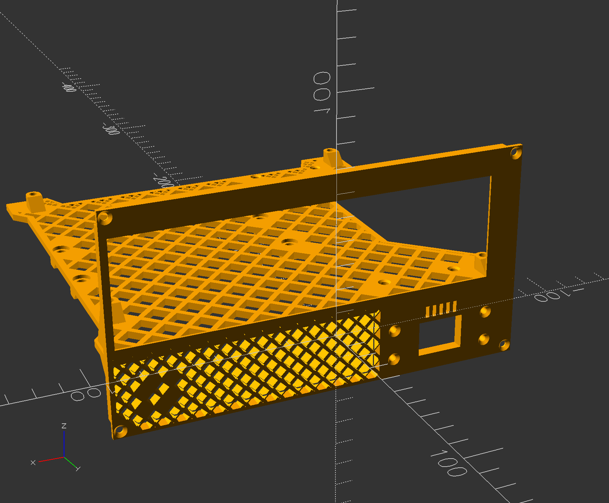
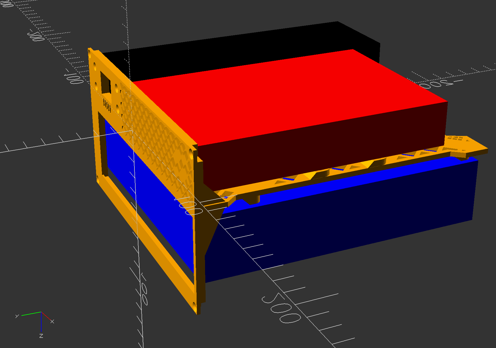

# Game of Life ITX Case — ITX Layout Study



A parametric OpenSCAD model built around the ["4.7L Mini ITX case, easily
printable (2 major pieces)"](https://www.printables.com/model/143897-47l-mini-itx-case-easily-printable-2-major-pieces)
design. The original pairs a fish-shaped **spine** (structural divider +
motherboard standoffs) with an outer **shell**. This project keeps the
spine's "sandwich" concept — a divider plate between a motherboard
compartment and a lower compartment — but redesigns the lower compartment
around different hardware:

- **GPU → 3.5" HDD**, vibration-isolated on O-rings
- **ATX/FlexATX PSU → HDPLEX 250W GaN AIO ATX PSU**, thermally isolated on O-rings
- Board: **ASRock B860I** (Mini-ITX)

The outer shell has not been redesigned yet — this is a layout and mounting
study for the spine only.

**`flat_print` branch:** the spine and the front plane are two separate
parts, each printed flat and joined by M3 flat-head screws into heat inserts
(see [Spine ↔ I/O plate joints](#spine--io-plate-joints)). The printed MB
standoffs are replaced by metal M3 standoffs.

## Contents

1. [Files](#files)
2. [Using the model](#using-the-model)
3. [Conventions](#conventions)
4. [Design reference](#design-reference)
   - [Enclosure and front face](#enclosure-and-front-face)
   - [Divider plate](#divider-plate)
   - [Standoffs](#standoffs)
   - [Front panel — upper (rear I/O)](#front-panel--upper-rear-io)
   - [Front panel — lower (HDD / PSU side)](#front-panel--lower-hdd--psu-side)
   - [Front panel mounting screws](#front-panel-mounting-screws)
   - [Spine ↔ I/O plate joints](#spine--io-plate-joints)
   - [Spine channel ribs](#spine-channel-ribs)
   - [CPU cooler and fan intake clearance](#cpu-cooler-and-fan-intake-clearance)
   - [PSU 24-pin routing (SC Shift adaptors)](#psu-24-pin-routing-sc-shift-adaptors)
5. [Printing](#printing)
   - [Orientation](#orientation)
   - [Tested profile](#tested-profile)
   - [Why these settings](#why-these-settings)
   - [If it still wobbles](#if-it-still-wobbles)
   - [Before slicing](#before-slicing)
6. [Hardware and assembly](#hardware-and-assembly)
7. [Self-checks (console warnings)](#self-checks-console-warnings)
8. [Known open items](#known-open-items)

## Files

| File | Purpose |
|---|---|
| `case_common.scad` | The shared model: every parameter and module (was `game_of_life_itx_case.scad`). Renders the live assembly (both parts) when opened directly; edit parameters here. |
| `spine.scad` | Renders the **spine** part (Orange) plus `io_plate.stl` in grey. Exports `spine.stl`. |
| `io_plate.scad` | Renders the **I/O plate** — the whole front plane: rear I/O, HDD grill, C14 (Orange) plus `spine.stl` in grey. Exports `io_plate.stl`. |
| `c14_tool.scad` | Included by the main file. Cutting tools for the C14 inlet (flange lip + body), with per-axis fit trims. Profiles auto-generated from `c14_socket.stl`. |
| `asrock_b860i_io_shield.scad` | Caliper-measured rear-I/O port layout for the ASRock B860I. Exported to `asrock_b860i_io_shield.stl`, which the main file imports and cuts into the front panel. |
| `c14_socket.stl` / `c14_snap-fit_socket.stl` | C14 inlet models (screw-mount / snap-in), selected by `USE_SNAP_IN_C14`. |
| `4.7-Fish_-_spine.stl` | Original spine reference. Front I/O opening, mounting holes, and taper shape were measured from it. |
| `4.7-Fish_-_case.stl`, `4.7-fish-step.step` | Original shell / STEP reference — not used in the model yet. |
| `asrock_b760m_itx_io_shield.scad`/`.stl`, `basic_layout.scad` | Legacy: the previous board's shield model and an early layout snapshot. Not used. |
| `print/game_of_life_itx_case_0.25mm_STRUCTURAL_PETG_MK4S.3mf` | PrusaSlicer project with the [tested print profile](#tested-profile). Embeds the Sep 29 mesh — reload the STL from disk before slicing. |
| `game_of_life_itx_case_0.4n_0.25mm_PETG_MK4S_4h2?m.bgcode` | **Stale:** Sep 25 slices with the stock profile (2 perimeters, 15 % grid) and old geometry. |

## Using the model

- Requires OpenSCAD **≥ 2021.01** (function literals are used for the -Y
  taper breakpoints). The manifold backend (`--backend=manifold`) is much faster.
- `used_components` toggles `SHOW_MB` / `SHOW_HDD` / `SHOW_GAN_PSU` /
  `SHOW_C14_SOCKET` together — translucent reference bodies for clearance
  checks. **Set it `false` before exporting.**
- `SHOW_SPINE` imports the *original* reference STL in a comparison pose;
  most "real" measurements were taken against it. Not part of the print.
- `SHOW_ODD` / `ODD_*` is a leftover slim-optical-drive placeholder, unused.
- `SHOW_GAN_BLOCKS` shows the SC Shift adaptor bodies and enables their
  report (see [PSU 24-pin routing](#psu-24-pin-routing-sc-shift-adaptors)).
- **Edit in `case_common.scad`.** Every parameter lives there (e.g.
  `SPINE_PANEL_SCREW_X` for the joint positions). Opened directly it shows
  the live assembly, both parts rebuilt from the current parameters, so a
  change shows on both at once without re-exporting. `ASSEMBLY_PREVIEW`
  switches this off; the part files set it `false`. Don't export from here.
- **Two part files.** Open `spine.scad` or `io_plate.scad`; each includes
  `case_common.scad`, renders its part in Orange and, with
  `SHOW_OTHER_PART = true`, imports the *other* part's STL in grey (world
  coordinates, so they line up). A missing STL only gives an import warning.
  The grey part is the last export, so re-export after changing parameters.
- **Export:** `SHOW_OTHER_PART = false` and `used_components = false` (the
  grey import and the component boxes would otherwise end up in the STL;
  a `NOTE:` echoes while the grey part is shown), then a full **Render
  (F6)** — the lightening pattern is slow and can be wrong in Preview. CLI:
  ```
  openscad --backend=manifold -D used_components=false -D SHOW_OTHER_PART=false -o spine.stl spine.scad
  openscad --backend=manifold -D used_components=false -D SHOW_OTHER_PART=false -o io_plate.stl io_plate.scad
  ```
  Both STLs are in world coordinates; orient them in the slicer (see
  [Printing](#printing)).
- After any change, **read the console for `WARNING:` lines** (see
  [Self-checks](#self-checks-console-warnings)).

## Conventions

- **Real vs free numbers.** Most dimensions come from a verifiable source
  (datasheet, spec, manufacturer STEP, caliper, or the reference STL).
  Others are free design choices. This README records which is which (the
  code keeps only terse inline notes). When a free parameter is *meant* to
  track a real value, the model computes that value each render and echoes a
  `WARNING:` on drift instead of silently overriding you.
- **Literals that can't be derived.** OpenSCAD evaluates top-level
  assignments in order, so a few positions are literals that depend on
  things defined later (`MB_POS[1]`, `GAN_PSU_POS[2]`, `ENCLOSURE_*` Z). Each
  has a drift warning that prints the value to set.
- **Manifold ≠ connected.** A watertight union can still contain disjoint
  bodies. Verify connectivity with STL-intersection probes:
  `intersection() { import("model.stl"); translate([x,y,z]) cube(s); }` —
  empty output where there should be material means something is loose.
- **Naming.** `PX`/`NX`/`PY`/`NY`/`PZ`/`NZ` = +X/-X/+Y/-Y/+Z/-Z edge or side.
  `UPPER`/`LOWER` = Z (MB side / HDD-PSU side).
- **Axes.** Front face at Y = 0, the case extends toward -Y. +Z is the MB
  side of the plate, -Z the HDD/PSU side.
- **Print orientation matters** — see [Printing](#printing) before assuming
  a design choice is arbitrary.

## Design reference



### Enclosure and front face

`ENCLOSURE_SIZE = [170.5, 178, 91.96]` @ `ENCLOSURE_POS = [2.75, -90, 14.52]`
is the outer volume budget and defines the front face's X and Z extent.

- **X: -82.5 .. 88.** +X is flush with the MB PCB. The Sep 25 test print
  (170 wide @ X 3) had the board flush on +X but ~1 mm past the face on -X,
  so the face grew 0.5 mm on -X only (free, from the test fit).
- **Z: -31.46 .. 60.5** (the panel itself tops out at `FRONT_PANEL_TOP_Z` =
  59.2, see [fan clearance](#cpu-cooler-and-fan-intake-clearance)). The
  bottom sits `FRONT_PANEL_PSU_CABLE_GAP` = **10.5 mm** below the PSU's bottom
  face (-20.96) — bend room for the 24-pin cable (free). History: 85 → 94
  (+9 on -Z for cable room) → 91.83 (trimmed to the 10.5 mm target) → 91.96
  (+0.13 when the GaN PSU moved to the HDD's thicker O-ring).
  `front_panel_lower()` warns if the gap drifts.
- When the bottom moved, the HDD grill's bottom margin and the C14 moved
  with it (see [lower panel](#front-panel--lower-hdd--psu-side)); the lower
  mount screws follow the edge automatically.

### Divider plate

#### Position and extent

`SPINE_PLATE_POS = [2.31, -89.75, 8.1]`, `SPINE_PLATE_SIZE = [170.6, 174.5, 3]`:
plate Z 6.6 .. 9.6, Y -2.5 .. -177.

- **The front edge butts against the I/O plate's back face** (Y −2.5 =
  −(`FRONT_PANEL_THICKNESS` + `SPINE_PANEL_GAP`), gap 0, free). It's a
  literal because the panel is defined later; the spine warns with the
  values to set if it drifts. (On `main` the edge overlapped the panel by
  0.5 mm, because the two were one print.) The PX/NX taper `BEFORE` runs
  are measured from this edge, so they sit 0.5 mm further back than on
  `main`.
- **X extent** comes from `SPINE_PLATE_NX_X` / `SPINE_PLATE_PX_X` (derived:
  2 mm inside each MB edge, 166 mm wide), superseding `POS`/`SIZE` X and
  `SPINE_PLATE_MARGIN_X`.

#### Edge tapers

The outline copies the reference STL's trapezoidal notches on the three
non-I/O edges, plus an optional second -Y notch:

| | `*_BEFORE` | `*_RUN` | `*_AFTER` | `*_DEPTH` |
|---|---|---|---|---|
| **+X** `SPINE_PLATE_TAPER_PX_*` | flat run from the front | Y-run of each slope | flat run from the back | X-depth into the plate |
| **-Y** `SPINE_PLATE_TAPER_NY_*` | flat run from the -X end | X-run of each slope | flat run from the +X end | Y-depth into the plate |
| **-Y #2** `SPINE_PLATE_TAPER_NY2_*` | same as -Y | same | same | same |
| **-X** `SPINE_PLATE_TAPER_NX_*` | flat run from the front | Y-run of each slope | flat run from the back | X-depth into the plate |

- `RUN` values were measured from the reference STL; `BEFORE`/`AFTER`/
  `DEPTH` are free.
- `PX_DEPTH` defaults to flush with the HDD standoffs, `NY_DEPTH` to flush
  with the GaN standoffs' -Y edge; `NY_DEPTH` warns when it no longer is.
- **NY2** is an independent second notch on the back edge
  (`SPINE_PLATE_TAPER_NY2_ENABLE`). The -Y edge is the *deeper* of the two
  cuts at every X, so the notches may sit apart, touch, or overlap. The
  edge is traced through the breakpoints of both tapers plus any point where
  their slopes cross (`spine_plate_ny_breaks()`); the outline and the
  lightening boundary share that list, so they always agree. With NY2
  disabled the geometry is identical to the single-taper version.
- **Checks:** `BEFORE + 2·RUN + AFTER` must fit the edge (else the outline
  self-intersects); every taper warns if it cuts past any MB/HDD/GaN
  standoff (the -Y check samples the edge across the standoff's whole width,
  so a slope under it is caught).
- Keep every taper that faces -Y at **RUN ≥ DEPTH** (≤ 45°) — with -Y up in
  the print, steeper tapers overhang.

#### Lightening pattern

`SPINE_LIGHTENING_MODE` (`"diamond"` default, or `"honeycomb"`) cuts a
pattern through the plate.

| Mode | Cell params | Notes |
|---|---|---|
| `"diamond"` | `SPINE_GRID_SLOT_W/H`, `SPINE_GRID_WALL` | Square grid rotated 45° — every wall is a short diagonal, no supports needed. Fewer, larger cells. **Default.** |
| `"honeycomb"` | `SPINE_HONEYCOMB_HEX_R`, `SPINE_HONEYCOMB_WALL` | Best open area per wall; slowest to print. |

A plain axis-aligned grid was removed: with -Y up, any wall running purely
along X becomes a full-width unsupported bridge.

- **Where it stops:** `SPINE_LIGHTENING_MARGIN_PX/NX/PY/NY`, independent,
  may be 0 or negative. PX/NX/NY follow their taper's real edge
  (`spine_plate_*_edge_points()`); PY is a flat line.
- **Applied as an axis-aligned box, not an `offset()` of the outline.** An
  outline `offset()` once left razor-thin through-slivers at the notches'
  reflex corners (a numerical artefact). If you reintroduce one, re-verify
  all notch corners with a full render and probes.
- **Standoff protection:** each standoff's peg *and* its print ramp stay
  solid. Cells aren't clipped by CSG; `grid_2d()`/`honeycomb_2d()` compute
  each cell's world position and skip any whose centre comes within
  `apothem − SPINE_LIGHTENING_STANDOFF_PROTECT_FUDGE` (0.3) of a footprint,
  so protected cells stay whole. `standoff_lightening_protect()` builds the
  footprints and drops standoffs already inside the solid margin (otherwise
  they leave a jog in the margin edge).
- **-Y inlay:** in diamond mode, cut cells whose circumradius reaches the
  -Y boundary are subdivided at `SPINE_LIGHTENING_NY_INLAY_SCALE` (0.4; 0 =
  off), so the clip halves small diamonds instead of big ones.

#### Tiling helpers

`honeycomb_2d()` / `grid_2d()` tile an oversized field and intersect it with
a `[w, h]` rectangle. `honeycomb_2d()` tiles on `r_tile = hex_r + wall/√3`
so the gap between neighbours is exactly `wall` in every direction;
flat-top hexes (`$fn = 6`) tile in columns offset by half a row.
`world_rot`/`world_translate` map cell centres into the frame the protect
data was computed in. `grid_2d()` also takes `inlay_edge_pts`/`inlay_scale`
and recurses once to subdivide a cell near that polyline.

### Standoffs

The HDD and GaN standoffs hang off the plate's underside, built along Z.
Printed flat (MB face down) they grow straight up; the 45° `standoff_ramp()`
on each +Y side (`STANDOFF_RAMP_RUN_FACTOR`, 1.0 = 45°) is left over from the
upright print and is no longer needed.

#### Motherboard (M3, metal standoffs)

- **Holes** (`MB_HOLES_RAW`): standard mITX pattern. Edge insets are 5.84 mm
  (-X) / 6.86 mm (+X). `MB_HOLES_X_SHIFT` moves only the standoff pattern
  (and so the board), not the panel; it is 0 = the Sep 25 print, where +X
  sat flush. The ~1 mm -X overhang was fixed by widening the face instead
  (1.02 was never printed and would push +X ~1 mm proud).
- **Height:** plate top 9.6 → PCB underside 15.6 (6 mm). `MB_STANDOFF_H` = 6.0
  (real part) is checked against `MB_POS[2]`; on a mismatch the spine warns
  with the `MB_POS[2]` to use. The I/O cut-outs follow `MB_POS`, so after
  changing it they move with the board.
  `MB_POS[1]` = -`FRONT_PANEL_THICKNESS` - `MB_PANEL_GAP` - 85 = -87.8
  (PCB edge 0.3 mm behind the panel; was -90 / 2.5 mm).
- **No printed standoffs.** Removing them leaves the MB face flat, which is
  what lets the spine print MB face down (the only support-free flat
  orientation — the HDD/GaN standoffs hang off the other face).
- **M3 × 4 insert in a boss under the plate:** the same insert as the
  [joints](#spine--io-plate-joints) — one part for the whole build
  (`SPINE_PANEL_INSERT_DIA/LEN` follow `MB_INSERT_HOLE_DIA/LEN`). The Ø3.6
  bore runs `MB_INSERT_LEN` 4.0 + `MB_INSERT_EXTRA` 0.9 down from the MB face,
  open below; `mb_insert_bosses()` (Ø7.2, 0.5 mm chamfer) extends the plate
  under each hole to the bore bottom, Z 4.7 — 1.9 mm below the plate. Printed
  MB face down, the bosses grow straight up. What sets the limit:

  | MB hole | Below | Boss clearance | Deepest insert |
  |---|---|---|---|
  | −X front (−76.16, −12.33) | C14 body (top 1.17) | 3.53 | M3×5.7 |
  | −X rear (−76.13, −166.93) | HDD (top 3.08) | 1.63 | M3×5 |
  | +X front / rear (81.14, …) | GaN PSU corner (top 4.04, PSU X ≤ 80) | **0.66** | **M3×4** |

  `mb_boss_checks()` echoes each and warns under `SPINE_PANEL_MIN_CLEARANCE`.
  The −X front boss merges with the X −70 joint boss; the bores stay 2.2 mm
  apart.
- **Metal standoff:** **M3 × 6 mm brass hex, male–female, male thread 3–4
  mm** (often listed as "M3×6+3" / "M3×6+4"). The male end screws straight
  into the M3×4 insert; 6 mm (body, excluding the thread) keeps the PCB
  underside at Z 15.6, so the I/O alignment is unchanged.
  - **Male thread length matters** — the bore is open below the boss (4.9 mm
    deep), so anything longer sticks out under it. Gap to the GaN PSU at the
    two +X holes: 3–4 mm → stays inside (0.66 boss clearance), 5 mm →
    **0.56** (too tight for real-world thread tolerance), 6 mm (the common
    "M3×6+6") → **hits by 0.44**. Measure before installing.
  - **Fallback:** M3 × 6 female–female + an **M3 × 5 set screw** (ISO 4026;
    4 mm in the insert, 1 mm in the standoff). Same height, one more part.
  - ATX case standoffs are 6-32 × M3 and ¼" (6.35 mm) tall — wrong thread
    for the insert and 0.35 mm too tall.
- **Ring:** `MB_INSERT_RING_R` = hole/2 + `MB_INSERT_MIN_WALL` = 3.6 mm stays
  solid in the lightening pattern; the hex (6.35 mm across corners) sits on
  it.

#### HDD (6-32 UNC, O-ring isolated)

- **Holes** (SFF-8301 Rev 1.9, Fig 3-1 / Table 3-1): A5 = 3.18 in from each
  long side (95.25 across); A7 = 41.28 from the connector end (-Y) to the
  first pair; A13 = 76.20 from *that pair* to the far pair (A6 = 44.45 for
  drives with only the middle pair). Seagate Exos uses A7 + A13 → a
  95.25 × 76.20 rectangle. (A13 was once wrongly measured from the drive
  end, putting the second pair only 34.92 mm behind the first.)
- `HDD_STANDOFF_R` 5, bore `HDD_STANDOFF_HOLE_R` 2.3, O-ring pocket
  `HDD_ORING_POCKET_DEPTH` 1.56 (~12.5% compression of AS568-007).
- **Pass-through access:** screws go in from the MB side, through the
  plate and standoff, into the drive's own threads.

#### GaN PSU (M3 nylon flat heads, O-ring thermal break)

- **Holes** (`GAN_PSU_HOLES`) from HDPLEX's STEP ("same as HDPLEX 200W /
  400W ACDC"). Screw sites (world) X 39.85 / 73.15, Y -18 / -162 — all under
  the MB.
- **Stack:** plate underside 6.6 → peg `GAN_STANDOFF_H` **1.0** (free; was
  2.67, shortened to lift the PSU) → O-ring gap `GAN_ORING_POCKET_DEPTH`
  1.56 → PSU top. So `GAN_PSU_POS[2]` = 6.6 − 1.0 − 1.56 − 12.5 = **-8.46**
  (a literal; `new_spine()` warns if it drifts from `GAN_STANDOFF_H`). The
  O-rings, not the peg, are the thermal break, so the short peg only trades
  air gap above the PSU.
- **Countersink:** `GAN_SCREW_CS_DIA` 6.4 × `GAN_SCREW_CS_ANGLE` 90° in the
  plate's top face, full diameter exactly at the surface so the head sits
  flush (a DIN 965 M3 head is 5.5–6.0, so it lands flush to ~0.45 mm under).
  It prints as a horizontal 45° cone. Bore `GAN_STANDOFF_HOLE_R` 1.9; the
  countersink centres the screw.
- **PSU DC outputs:** all four headers (24-pin Molex 46207-1024, 8-pin EPS,
  8-pin PCIe, 4-pin SATA) are on one 170×55 face within ~30 mm of one end.
  Here that face is -Z and the cluster is at the rear (-Y); the AC pigtail
  exits the front toward the C14.

### Front panel — upper (rear I/O)

`FRONT_PANEL_THICKNESS` = 2.5 (front face Y = 0). Spans the plate bottom
to `FRONT_PANEL_TOP_Z`.

#### Port cutout

The panel is the I/O shield: the port holes come straight from
`asrock_b860i_io_shield.stl`, flattened with `projection()` and extruded
through the full panel thickness (the STL's own 0.25 mm depth isn't
trusted).

- The projection is solid *with* holes, so the cut is its complement inside
  a square inset by `IO_SHIELD_EDGE_INSET` (1.0) — the inset keeps the
  shield outline itself from cutting a slot; it must stay smaller than the
  nearest port's distance to the shield edge.
- `IO_SHIELD_STL_SIZE = [155.0, 40.5]` must equal the STL's bounding box.
  (It was [154.75, 40.75]; the extra 0.25 mm cut a hairline slot across the
  panel at Z ≈ 55.3, hidden until the panel grew above 55.)
- It is centred in the ATX-derived I/O rectangle `FRONT_PANEL_IO_OFFSET`
  (`[x_min, x_max, z_min, z_max]` relative to `MB_POS[0]` / board bottom).
  Shield-local y = 0 is the HDMI/DP end, which maps to world Z under
  `rotate([90,0,0])` (verified: DP renders above HDMI).
- `IO_SHIELD_Z_SHIFT = 0.0` (free, test-fit). History: the first print
  read as ports ~2.0 mm above their cutouts, so it was set to +2.0. The
  Oct 1 fit (board screwed down) had the cutouts ~1.5–2 mm *above* the
  ports, the same on both ends, and the board height had not changed in
  between, so the first correction went the wrong way; it is back to 0.0.
  Model check at 0.0: the lowest USB-A hole bottom is at Z 17.22 vs the PCB
  top at 17.2, flush with a stacked USB-A's bottom shell. The shift moves the
  holes, the USB-C relief and the pocket; **change `IO_POCKET_EXTRA_PZ` by
  the opposite amount** so the pocket top stays put for the Wi-Fi housing.

#### Port pocket

A recess in the panel's back face under the port cluster, so connectors
that stick out past the PCB can nest into the panel and plugs pass through
less wall.

| Parameter | Value | Real / free |
|---|---|---|
| `MB_PANEL_GAP` | 0.3 | free — PCB edge to panel back face |
| `IO_PORT_OVERHANG` | 1.0 | **real** — calipered (furthest housing) |
| `IO_PORT_CLEARANCE` | 0.5 | free — connectors get 1.0 + 0.5 = 1.5 mm of room |
| `IO_POCKET_DEPTH` | 1.2 | free — 0.3 + 1.2 = 1.5 mm; leaves a **1.3 mm** skin over the ports |
| `IO_POCKET_MARGIN` | 2.0 | free — housing size beyond its hole, per side |
| `IO_POCKET_EXTRA_NX` | 2.5 | free — extra on -X only (below) |
| `IO_POCKET_EXTRA_PZ` | 5.0 | free — extra on +Z only (below) |
| `IO_POCKET_SCREW_WALL` | 1.0 | free — solid ring kept around each top-edge countersink |

- **One rectangle**: the hull of per-column bands from the PCB top (the
  housings sit on the board) to the highest opening, grown by the margin.
  One big pocket gives more room for error than per-stack pockets, at the
  cost of the ribs between stacks. (An earlier hull-of-holes version cut
  ~2 mm into the video and audio stacks' boxes.)
- **Audio housing:** the audio stack (-X-most column, jacks at X
  -56.61..-48.61) has a metal housing reaching 2 mm past its holes on -X —
  exactly the margin, i.e. zero air. `IO_POCKET_EXTRA_NX` stretches the
  pocket 2.5 mm further on -X (4.5 mm past the jacks). The nearest feature
  is the -X corner screw's keep-out, ~12 mm away.
- **Wi-Fi housing:** the metal housing around the antenna connectors hit
  the panel above the pocket in a test fit, so the pocket top was raised
  3 mm to **Z 57.23**, leaving a 1.97 mm full-thickness strip below the
  panel's top edge (59.2). `IO_POCKET_EXTRA_PZ` is 5.0 = those 3 mm plus
  the 2 mm the holes dropped when `IO_SHIELD_Z_SHIFT` went 2.0 → 0.0. The
  top-edge screw keep-outs are still subtracted.
- Pocket extent: X -61.12 .. 83.75, Z 15.02 .. 57.23. It's on the back face
  (the top as printed), so no supports.
- `front_panel_upper()` warns if the overhang plus clearance doesn't fit, or
  if `MB_POS[1]` drifts from `MB_PANEL_GAP`.

#### USB-C overmold relief

USB Type-C leaves almost no room for a panel in front of the receptacle
(USB Type-C Cable and Connector Spec R2.0): the plug's exposed shell is
**≥ 6.51 mm** (Fig 3-3), the receptacle's effective shell length is
**6.20 ± 0.20 mm** (Fig 3-1, note 7), and the overmold should clear the
exterior surface by **≥ 0.05 mm** when seated (Fig 3-80). That allows
6.51 − 6.20 − 0.05 ≈ **0.26 mm** between the receptacle front and the outside
of the case nominally, and ~0.06 mm worst case — effectively flush. Here
the receptacle front sits ~1.8 mm behind the face (PCB edge Y -2.8 + ~1 mm
port overhang), so only cables with extra-long plugs seat. Shaving 0.3 mm
off the skin would leave 1.5 mm — still far outside the spec.

Instead, `USB_C_RELIEF` cuts an overmold-sized pill (`USB_C_RELIEF_SIZE`
13 × 7, free) through the panel around the USB-C port, so the overmold
passes the face into the pocket and the plug seats regardless of panel
thickness. `USB_C_RELIEF_CENTER` is the port centre in shield-STL
coordinates ([116.14, 5.25], from `asrock_b860i_io_shield.scad`: mirrored
stack-1 X plus `usbc_x_offset`). World extent X 42.63..55.63, Z 16.52..23.52,
leaving 2.25 mm of wall below the USB-A above it. Caliper your cable's
overmold and resize if it is larger (thick braided cables can be).

### Front panel — lower (HDD / PSU side)

#### HDD grill

`HDD_GRILL_MODE` (`"diamond"` / `"honeycomb"`) around the drive's front
face, with independent margins. **Top:** with the [spine ribs](#spine-channel-ribs)
on, the top edge sits `HDD_GRILL_RIB_GAP` (1.25) below the lower rib's foot,
Z 2.05 (`HDD_GRILL_MARGIN_TOP` only applies with `SPINE_RIB_ENABLE = false`;
before, the grill nominally ran to Z 12.08 but everything above Z 6.6 was
hidden behind the solid upper panel). The Game of Life shapes are anchored
to the grill centre, so they stay centred when the top or bottom moves; to
tune the band, use `HDD_GRILL_RIB_GAP` (top), `HDD_GRILL_MARGIN_BOTTOM`
(bottom), `HDD_GRILL_W` / `HDD_GRILL_POS_X` (width / X), and the
`GOL_Grill_N_ANCHOR` cells. `HDD_GRILL_MARGIN_BOTTOM` =
6.83 extends it down into the grown face while keeping a ~1.46 mm solid
border above the bottom edge (9 when the face was 94 tall, −2.17 with the
trim). `HDD_GRILL_WALL` applies to both modes; diamond cells use their own
`HDD_GRILL_DIAMOND_SLOT_W/H`.

- Any cell within `FRONT_PANEL_SCREW_GRILL_WALL` (1.2) of a mount-screw
  countersink stays solid. In grill-local coordinates x = X − grill_x,
  y = −(Z − grill_z); the protect test is centre-vs-apothem, so the rotated
  cell's circumradius is added.
- `FRONT_PANEL_CORNER_INFILL_X/Z` cuts a guard wedge out of the pattern at
  the +X/−Z corner screw.

#### Game of Life shapes (diamond mode)

Up to four `[SHAPE, ANCHOR]` slots (`GOL_Grill_N_SHAPE` / `_ANCHOR`) leave
cells solid in a pattern. `SHAPE = GOL_OFF` disables a slot. Currently slots
1 and 3 use `LIFE_HEX_RING`; 2 and 4 are off.

- `LIFE_BLOCK` (2×2), `LIFE_BEEHIVE`, `LIFE_POND` are still-life
  silhouettes. BEEHIVE/POND get a bridge cell at each diagonal-only joint so
  every cell shares a full edge (no longer Life-stable, but prints as one
  shape). `LIFE_HEX_RING` is BEEHIVE's outline deliberately *without*
  bridges.
- `ARROW_GT_2/3`, `ARROW_LT_2/3` are plain chevrons: two straight index-space
  lines sharing a corner cell; the grid's 45° rotation renders them
  diagonal.
- `ANCHOR` is a `grid_2d()` index `[i0, j0]` in the *pre-rotation* lattice
  (step = slot + wall); `diamond_anchor(x, y)` converts intuitive steps.
  Check the whole shape lands on the grill, not just the anchor — cells past
  the grill edge silently do nothing. `life_pattern_protect_pts()` turns a
  shape into zero-radius protect points, reusing the standoff-protection
  mechanism.

#### C14 inlet

- **Current socket:** the HDPLEX-supplied screw-mount C14, switching to a
  variant with **right-angle pins**, which removes the earlier clash between
  the socket's rear body/terminals and the HDD (the straight socket reached
  Y -28.6 vs the drive front at -22.5). The model still uses
  `c14_socket.stl` for the cutout — confirm the right-angle socket's front
  lip and flange match it.
- `C14_POS = [-52.5, -2, -9.83]` (X free; Z free — lowered 4 mm when the
  face grew, then raised 2.17 with the bottom trim). `C14_ROT = [270, 180, 0]`.
- **Mounting:** socket from inside, eared flange against the back face;
  M3×10 nylon 90° flat head from outside → panel → flange → **M3 all-nylon hex nut**
  (the flange holes are plain 3.2 mm clearance). `C14_SCREW_PITCH` 42 runs
  along world X for this `C14_ROT` (re-check if the rotation changes);
  countersinks match the front-panel screws (6.4 × 90°).
- **Datum:** the socket's front face is flush with Y = 0.
  `c14_solid_tool()` pockets the 2 mm front lip and cuts the body; the
  eared flange spans Y -5..-2 against a back face at -2.5, so
  `c14_flange_pocket()` cuts the flange outline into the back face (sliced
  from the STL mid-flange at local z -1.5, screw holes closed, +0.3 mm
  clearance). Screw-mount only.
- **Fit trims** (`c14_tool.scad`, total mm, negative grows; local X → world
  X, local Y → world Z): test fit had the lip pocket ~1.0 mm too tall and
  ~0.25 mm too wide, so 31.6 × 22.6 → 31.35 × 21.6
  (`C14_FLANGE_TRIM_X/Z` = 0.25 / 1.0). `c14_trim_2d()` keeps corner radii
  and is valid while each straight side is longer than the trim. Base fit
  clearance 0.3 mm.
- `USE_SNAP_IN_C14` switches to the snap-in model (cutout
  `C14_SNAP_CUTOUT_W/H` 28 × 20.5).

#### Disabled features

The GaN power-cable opening, the PSU front-mount screws, and the small
MB↔PSU vent-bar grill are **not cut** (their code was disabled, and has
been removed from the file; it's in git history). `GAN_CABLE_CUTOUT_*`,
`GAN_FRONT_MOUNT_*` and `FRONT_VENT_*` remain as unused parameters. The
front-mount spacing was never verified — the real PSU uses a length-wise
rail (177 × 35 mm, M3).

### Front panel mounting screws

Six M3 × 90° countersunk holes, heads flush at Y = 0: the four outer
corners plus mid-X on the top and bottom edges.

- Insets `FRONT_PANEL_SCREW_X/Z_INSET` = 5 to the hole centre, so the
  countersink edge is 5 − 3.2 = **1.8 mm** from the panel edge (was
  3.5/4.0 → 0.3/0.8 mm).
- `FRONT_PANEL_SCREW_R` 1.7 (3.4 mm clearance; was 1.5, a thread-forming
  fit). Cone reaches full diameter exactly at the face (it used to leave
  heads 0.5 mm proud).
- X positions derive from the enclosure X extent (outer corners 5 mm in,
  mid at the face centre X 2.75); Z from each panel's outer edge.
  `FRONT_PANEL_MOUNT_OFFSET_UPPER/LOWER` add per-hole `[dx, dz]` nudges (all
  0 now); the grill keep-out follows.
- The lower +X corner used to be skipped for the GaN PSU; since the face
  grew it sits well below the PSU.

### Spine ↔ I/O plate joints

The I/O plate is screwed to the spine's front edge with **M3 × 10 90° flat
heads** (same length as the rest) through countersinks identical to the
shell-mount holes, into **M3 × 4 heat-set inserts** (the same part as the MB
holes) in bosses on the spine.

- **One list drives both parts:** `SPINE_PANEL_SCREW_X = [-70, 0, 84]`
  (free — edit freely). `spine_panel_screw_pts()` feeds the panel
  countersinks (`spine_panel_screw_holes()`, in `io_plate()`) and the bosses
  and bores (`spine_panel_bosses()` / `spine_panel_boss_bores()`, in
  `new_spine()`), so they line up by construction.
- **Boss:** a "D" — the hull of a Ø7.2 cylinder (insert Ø3.6 + 2 × 1.8 wall)
  and the plate slab, along −Y. Its top is **flush with the MB face** (Z
  9.6); the bore axis sits one wall below at `SPINE_PANEL_SCREW_Z` = 6.0 and
  the boss bottom at Z 2.4. Printed MB face down, it grows straight up.
- **Length:** insert bore Ø3.6 × 5.0 (4.0 + 1.0 for displaced plastic), then
  a Ø3.4 clearance bore to the screw tip + 1 mm (the screw enters 7.5 mm past
  the 2.5 mm panel, to Y −10), then a 1.5 mm closed end → boss Y −2.5..−12.5.
  Change `SPINE_PANEL_SCREW_LEN` / `SPINE_PANEL_INSERT_*` and it follows.
- **Grill:** the countersinks are added to the HDD grill's screw keep-out,
  so cells within `FRONT_PANEL_SCREW_GRILL_WALL` stay solid. The boss
  footprints (+ one `SPINE_GRID_WALL`) are kept solid in the lightening
  pattern.

**Where joints can go.** Everything under the spine's front edge is tight:

With `GAN_PSU_POS[0]` = 52.5 (PSU X 25..80) and the 0.5 mm minimum clearance:

| Boss centre X | What limits it | Verdict |
|---|---|---|
| −82.5 .. −78.9 | boss past the case side (X −82.5) | blocked |
| −78.9 .. −72.5 | joint insert bore < 0.5 mm from the MB insert bore at (−76.16, −12.33) | blocked |
| −72.5 .. ~−24 | C14 body, top Z 1.17 → **1.23 mm** air | OK (re-check for the right-angle socket) |
| ~−24 .. 21.35 | nothing (HDD starts at Y −23.5) | free |
| 21.35 .. 83.65 | GaN PSU: front face Y −4, top Z 4.04 | blocked |
| **83.65 .. 84.4** | PSU corner (0.5 mm) on one side, case side X 88 on the other | OK, a 0.75 mm window |

(For the M3×4×4 insert, `MB_INSERT_HOLE_DIA` 3.6 → boss R 3.6; a larger insert grows the boss and shrinks these windows.)

The +X window exists only because the boss is a "D": its rounded bottom
clears the PSU's top corner (0.85 mm at X 84) where a square boss would not.
Moving the PSU in X moves the window with it.

`spine_panel_joint_checks()` (runs with the spine) uses the real D profile
(`spine_panel_boss_gap()`): it echoes each boss's gap to the PSU / HDD / C14
body when under 2 mm, and warns when the gap is under
`SPINE_PANEL_MIN_CLEARANCE` (0.5), when the joint's insert bore comes within
that of an MB insert bore, when a boss overlaps an HDD/GaN standoff or passes
the case side (X −82.5 / 88), or when a countersink comes within 1 mm of the
C14 flange or the I/O pocket. Hanging past the spine plate's edge is only
noted (fine). The MB insert bores are re-cut after the bosses, so a boss
next to one can't fill it. The C14 body extent
(`C14_BODY_HALF_W` 25.0, `C14_BODY_TOP_DZ` 11.0, `C14_BODY_DEPTH` 28.6) was
measured from `c14_socket.stl` — re-measure for the right-angle socket.

### Spine channel ribs

Two ribs on the I/O plate's back face, one above and one below the spine's
front edge, form a channel the spine pushes into. They locate the spine in Z
and take bending/shear (e.g. plugging rear-I/O cables) so the joint screws
only clamp; they stiffen the 2.5 mm plate rather than weaken it (a groove
would leave 0.5–1.5 mm across the full width). The plate prints face down,
so the ribs grow straight up with no supports.

| Parameter | Value | What it does |
|---|---|---|
| `SPINE_RIB_ENABLE` | true | ribs on/off (off restores the old grill top) |
| `SPINE_RIB_DEPTH` | 2.0 | stand-off from the panel back (Y) |
| `SPINE_RIB_THICK` | 1.6 | rib thickness (Z) |
| `SPINE_RIB_CLEARANCE` | 0.2 | per side, rib to spine plate (channel = 3.0 + 0.4) |
| `SPINE_RIB_RAMP` | 1.5 | 45° root ramp on each rib's outer side, capped at the depth |
| `SPINE_RIB_LEAD_IN` | 0.4 | chamfer on the channel side of each tip |
| `SPINE_RIB_NOTCH_CLEARANCE` | 0.3 | lower-rib gap each side of a joint boss |
| `SPINE_RIB_X_INSET` | 0 | trims both ends in from the spine's front-edge width (X −80..86) |
| `SPINE_RIB_MB_CLEARANCE` | 2.0 | minimum upper rib → MB PCB underside (through-hole pins) |
| `HDD_GRILL_RIB_GAP` | 1.25 | solid face between the grill top and the lower rib's foot |

All free values. Derived: upper rib Z 9.8–11.4 (foot to 12.9), lower rib Z
4.8–6.4 (foot to 3.3).

- **Lower rib is notched at each joint boss** (the bosses hang below the
  plate there); the notches also locate the spine in X.
- **Spine edge is solid:** `SPINE_LIGHTENING_MARGIN_PY` = 3, matching the
  other sides (was 0). Warned if it drops below `SPINE_RIB_DEPTH`.
- **Clearances** (echoed by `spine_rib_checks()`, warned under
  `SPINE_PANEL_MIN_CLEARANCE` / `SPINE_RIB_MB_CLEARANCE`): lower rib
  0.76 mm above the GaN PSU and 2.13 mm above the C14 body; upper rib
  3.0 mm below the MB PCB; upper foot vs the I/O pocket.
- **Grill top follows the lower rib:** with ribs on, the grill's top edge is
  `SPINE_RIB_LOWER_FOOT_Z − HDD_GRILL_RIB_GAP` (Z 2.05) and
  `HDD_GRILL_MARGIN_TOP` is unused. See [HDD grill](#hdd-grill).

### CPU cooler and fan intake clearance

The cooler is a downdraft unit: the fan sits on the fin stack and fires
**−Z**, so the panel above faces the fan's **intake**. `FAN_PANEL_GAP` =
**5 mm** from the intake face to the panel's inner face (free; don't go
below ~4).

#### Why 5 mm

Vent cell size must be ≤ the gap (or the blades see jets), and honeycomb
open area is `(c/(c+t))²` with a printable web `t` ≈ 1.0 mm — so a smaller
gap forces smaller cells and less open area. Thick-orifice model
(`K = (1/(Cd·σ))² − 1`, `Cd ≈ 0.88` chamfered), 92 mm fan at ~40 CFM
(3.5 m/s, 7.4 Pa dynamic head):

| Gap | Max cell | Open area | ΔP sharp | ΔP chamfered |
|----:|---------:|----------:|---------:|-------------:|
| 2 mm | 2 mm | 44% | 90 Pa | 41 Pa |
| 3 mm | 3 mm | 56% | 53 Pa | 23 Pa |
| 4 mm | 4 mm | 64% | 39 Pa | 16 Pa |
| **5 mm** | **5 mm** | **69%** | 32 Pa | **12 Pa** |
| 8 mm | 8 mm | 79% | 23 Pa | 8 Pa |
| 15 mm | 15 mm | 88% | 17 Pa | 5 Pa |

A low-profile 92 mm fan makes ~15–25 Pa. Below ~4 mm the vent eats a large
share of that; above ~6 mm the curve flattens. **5 mm is the knee.** A
*solid* panel vented only at the perimeter would need ~19 mm instead.

Vent rules that go with it: cells ≤ 5 mm with ~1.0 mm webs (hex, not round
punch — punch patterns are only 35–40% open); **chamfer the intake side**
(Cd 0.6 → 0.88, roughly halving the loss); perforate out to ~112 mm square
over the fan and no further.

#### Stack-up

```
MB_PCB_TOP_Z      17.2   = MB_POS[2] − MB_SIZE[2]/2 + MB_PCB_THICK
CPU_COOLER_HEIGHT 37.0   real, Thermalright low-profile, PCB top → fan top
CPU_COOLER_TOP_Z  54.2
FAN_PANEL_GAP      5.0
FAN_PANEL_INNER_Z 59.2   = FRONT_PANEL_TOP_Z   (was a hard-coded 55 from the reference STL)
```

The cooler block uses `MB_PCB_TOP_Z`, so it must stay below the MB block in
the file. `cooler_clearance_report()` echoes this every render and warns if
the gap drops below 4 mm, the panel overshoots the enclosure top (60.5), or
`MB_SIZE[2]` understates the cooler.

> **Assumption:** `CPU_COOLER_FAN_D = 92` (AXP90 class) — verify. The table's
> percentages are portable; the Pascals are a first-order Idelchik model,
> ±40%.

> **Known discrepancy:** `MB_SIZE[2] = 38` puts the MB envelope top at 53.6,
> 0.6 mm below the cooler. Don't fix it by editing `MB_SIZE[2]` alone —
> `FRONT_PANEL_IO_OFFSET` hangs off the board bottom, so also move
> `MB_POS[2]` by half the change.

### PSU 24-pin routing (SC Shift adaptors)

Enabled with `SHOW_GAN_BLOCKS`. Plan: Singularity Computers "Shift
Motherboard 24pin 180 Degree Adaptor Short" (SC-A-180-24-S, rigid dual-layer
PCB), one on each header, turning the two sockets to face each other.

- `SC_ADAPTOR_SIZE = [52, 32, 22]` (real). The 32 is the **lateral offset**
  between its two connectors, not a length; it runs along world -Y here.
  (The non-Short variant is 42 × 52 × 22: 52 mm offset.)
- PSU side: mates onto the down-facing 24-pin (`GAN_24PIN_*`: Mini-Fit Jr
  12×2 @ 4.2 mm, 51 × 10, header 11 mm — real; inset 8 mm from the rear end
  — free), turns it up, offset -Y so the socket clears the plate's rear
  edge. MB side: mates onto the up-facing MB 24-pin and turns it down,
  landing above the PSU adaptor's socket.
- **Unconfirmed:** assumes the MB 24-pin sits at `MB_24PIN_IMPLIED`; not yet
  checked against the real B860I.
- 24-pin cables are specified connector face to face, so
  `SC_CABLE_FREE_SPAN` (board top − PSU bottom) *is* the cable length to
  order. Practical floors: `SC_MIN_SPAN_FLAT` 45 mm (flat/ribbon custom),
  `SC_MIN_SPAN_ROUND` 70 mm (round bundle; the HDPLEX in-box short cable is
  ~70). `gan_adaptor_report()` echoes the span, the implied MB header
  position, the rear chase depth, and warns if the span is too short or the
  junction still overlaps the plate.
- `SHOW_GAN_PSU_500W` shows a fit-check box for the HDPLEX 500W GaN
  (200.2 × 55 × 40) in the same slot.

## Printing

### Orientation

**`flat_print` (this branch): two flat parts.**

- **Spine: MB face down** (flip `spine.stl` 180° about X or Y in the
  slicer). It's the only flat orientation without supports: the HDD/GaN
  standoffs and the joint bosses all hang off the other face and grow
  straight up. The GaN countersinks are on the bed face (a 45° cone,
  self-supporting); the joint bores are horizontal Ø3.6 / Ø3.4 (bridge).
- **I/O plate: front face down** (rotate `io_plate.stl` −90° about X). The
  I/O pocket and C14 flange pocket are on the back face, the top as printed.
- The tall-print constraints below (no lightening wall along X, −Y tapers
  ≤ 45°) no longer apply; they're kept for reference.

**One-piece upright print (`main`):** print with the spine's **+Y face (the
front panel) down**, build direction +Y → −Y. Consequences:

- **Standoffs** lie horizontal, so each has a 45° ramp on its +Y side. The
  ramp is two `hull()`s: peg → constant-width bar, then the bar tapering
  flush to the plate over `run`.
- **Standoff and plate bores** (3.8–7.64 mm) are horizontal but small enough
  to bridge; the 7.64 mm HDD O-ring pocket is the one to test first. MB
  insert bores (4.0 mm) may print slightly oval — heat inserts tolerate it.
- **Front-panel holes** are vertical in this orientation — no concern.
- **The I/O pocket and C14 flange pocket** are on the panel's back face, the
  top as printed.
- **No lightening wall may run purely along X** (see
  [Lightening pattern](#lightening-pattern)).
- **-Y-facing tapers ≤ 45°** (RUN ≥ DEPTH).
- **On the bed (MK4S):** the 170 mm edge runs **left–right (along bed X)**,
  as tested.

### Tested profile

> [!NOTE]
> This profile was tuned for the **one-piece upright print** on `main`
> (177 mm tall, wobble-prone). The flat parts on this branch don't need the
> anti-wobble measures; start from stock 0.25mm STRUCTURAL / PETG.

Prusa MK4S, 0.4 HF nozzle, PrusaSlicer 2.9.2. Based on the stock
**0.25mm STRUCTURAL** print profile and **Generic PETG**, tuned for a tall,
thin part. **~6 h 34 m, ~63 g** (stock profile: 4 h 24 m, 60 g). Project file:
`print/game_of_life_itx_case_0.25mm_STRUCTURAL_PETG_MK4S.3mf`.

| Group | Setting |
|---|---|
| Filament | PETG, 250 °C first layer / **240 °C**, bed **90 °C**, max volumetric **12 mm³/s** |
| Layers | **0.25 mm** (first 0.2), top 4 / bottom 3 (min 0.7 / 0.5 mm) |
| Walls | **3 perimeters**, Arachne, seam aligned |
| Infill | **25 % gyroid**; top monotonic lines, bottom monotonic |
| Adhesion | **5 mm outer brim** (0.1 gap), no skirt, elephant-foot comp 0.2 |
| Supports | none |
| Speeds (mm/s) | ext perim 30, perim 45, small perim 25, infill / solid 70, top 45, gap fill 35, bridge 50, first layer 20, travel 180 |
| Accel (mm/s²) | default 1000, ext perim 600, perim / bridge / top 800, solid 1000, infill 1200, first layer 500, travel 1500 |
| Cooling | fan always on 35–60 %, off for layers 1–3, bridges 40 %; full fan below a 30 s layer; slow down below a 12 s layer (min 10 mm/s) |
| Travel | avoid crossing perimeters, Z-lift **0.3**, retract 0.8 mm |
| Custom G-code | `M221 S95 ; 95% flow for top of spine` at **Z 129.2** (layer slider) |

### Why these settings

The spine is a 3 mm wall ~177 mm tall anchored only at the bed, so its top
sways. Changes from the stock base:

- **Lower accelerations** (default 2500→1000, infill 4000→1200, travel
  4000→1500) and **speeds** (ext perim 45→30, perim 80→45, infill 120→70,
  travel 300→180): most of the sway comes from inertial kicks at direction
  changes.
- **Volumetric cap 21→12 mm³/s, nozzle 250→240 °C:** cooler, stiffer
  extrusions.
- **Min layer time 7→12 s, fan threshold 20→30 s, fan 20–40→35–60 %:** thin
  top layers set before the nozzle returns.
- **3 perimeters + 25 % gyroid** (from 2 + 15 % grid): stiffer while
  printing, and stronger standoffs and insert bores.
- **Z-lift 0.15→0.3, avoid crossing perimeters:** fewer nozzle strikes on the
  swaying top.
- **Bed 85→90 °C first layer, 5 mm brim:** holds the base of the tall lever
  arm.
- **`M221 S95` above Z 129.2:** slightly less material on the top section, so
  the nozzle doesn't drag on it and start it wobbling.

### If it still wobbles

1. **Slow the top further:** live (**Tune → Speed → 60–70 %** at ~100 mm), or
   add a custom G-code at ~100 mm alongside the M221:
   ```
   M220 S65          ; 65% speed from here up
   M201 X1000 Y1000  ; cap acceleration (verify your firmware honours it)
   ```
   A height-range modifier changes speeds but not accelerations — weakest.
2. **Geometry:** `SPINE_GRID_WALL` toward 2.0–2.5, a larger
   `SPINE_LIGHTENING_MARGIN_NY`, or breakaway braces from the front panel.

### Before slicing

Re-export the STL with `used_components = false` (see
[Using the model](#using-the-model)), open the 3mf, and right-click the
object → **Reload from disk**. The settings and the M221 carry over. The 3mf
points at `/Users/ftorales/Projects/itx_case/game_of_life_itx_case.stl`; on
another machine, use **Replace with STL** instead.

## Hardware and assembly

Two thread standards: **M3** everywhere except the HDD's **6-32 UNC**. All
M3 flat-head joints use one length: **M3×10 nylon 90° flat head**.

**Buy list:**

| Item | Qty | For |
|---|---|---|
| M3×10 nylon 90° flat head (DIN 965 / ISO 7046) | 15 (+5 spare) | GaN ×4, C14 ×2, front panel ×6, spine ↔ I/O plate ×3 |
| M3×4 heat-set insert — **one listing, one OD**; set `MB_INSERT_HOLE_DIA` to its recommended hole | 7 | 4 motherboard + 3 spine ↔ I/O plate |
| M3×6 brass hex standoff, male–female, **male thread 3–4 mm** ("M3×6+3"/"+4") | 4 | Motherboard (not the common M3×6+6 — hits the PSU) |
| M3×5 pan head | 4 | Motherboard → standoffs |
| 6-32 UNC × 3/8" pan / button head | 4 | HDD |
| AS568-007 silicone O-ring (ID 3.68, OD 7.24, CS 1.78) | 12 | HDD ×8, GaN ×4 |
| M3 hex nut, all-nylon (PA66) | 2 | C14 |

**Insert OD** (all checked: no warnings, no part intersections; MB boss clearances don't change, they depend on length only):

| Insert | `MB_INSERT_HOLE_DIA` | `SPINE_PANEL_INSERT_WALL` | Joint boss → C14 / PSU | Notes |
|---|---|---|---|---|
| **M3×4×4** (OD 4.0) — **modelled** | **3.6** | 1.8 | 1.23 / 0.85 | easiest to find; thinnest knurl, so snug the standoffs gently; print a test hole |
| M3×4×4.5 (OD 4.5–4.6) | 4.0 | 1.8 | 0.83 / 0.52 | best grip-to-size balance |
| M3×4×5 (OD 5.0) | 4.4 | **1.6** | 0.83 / 0.52 | with wall 1.8 the boss comes within 0.43 / 0.25 mm and warns |

All three countersinks (GaN, C14, front panel) are Ø6.4 × 90° over a
3.4–3.5 mm hole, ~1.5 mm deep; a DIN 965 head (Ø5.5–6.0) lands flush to
~0.45 mm under. Flat-head length includes the head.

| Joint | Qty | Thread | Length | Head | Notes |
|---|---|---|---|---|---|
| Standoffs → plate | 4 | M3 | standoff male thread 3–4 mm | hex | Male end into the **M3×4 insert**; a 3–4 mm thread stays inside the 4.9 mm bore. Fallback: F-F standoff + M3×5 set screw. |
| Motherboard → standoffs | 4 | M3 | **5 mm** | pan | 1.6 mm PCB + 3.4 mm into the standoff's female end. Check its thread depth before going longer (with the F-F fallback, M3×6 hits the set screw). |
| I/O plate → spine | 3 | M3 | 10 mm | nylon, 90° flat head | Snug only — the channel ribs carry the load. 2.5 mm panel + 7.5 mm into the spine: 4 mm in the **M3×4 insert**, 3.5 mm in the clearance bore; tip 1 mm short of the bore end. See [joints](#spine--io-plate-joints). |
| HDD → standoffs (from MB side) | 4 | **6-32 UNC** | 3/8" (9.53 mm)† | pan / button | Into the drive's bottom holes. The screw touches only the two O-rings and the drive threads. **Not** countersunk — the O-ring needs a flat face. |
| HDD isolation O-rings | 8 | — | AS568-007 (ID 3.68, OD 7.24, CS 1.78 mm) | silicone 70A | Two per standoff: under the head and between standoff and drive. |
| GaN PSU → standoffs (from MB side) | 4 | M3 | **10 mm**‡ | **nylon, 90° flat head** (DIN 965 / ISO 7046) | Into the PSU's tapped holes. Head flush in the plate top, so nothing stands proud under the MB's solder pins. |
| GaN isolation O-rings | 4 | — | AS568-007 (ID 3.68, OD 7.24, CS 1.78 mm) — same as the HDD | silicone 70A | **One** per screw, between standoff face and PSU body. Thermal break. |
| Front panel → shell | 6 | M3 | 10 mm | nylon, 90° flat head | All four corners + top/bottom mid. 2.5 mm panel leaves **7.5 mm** of screw — the shell's bosses/inserts must accept it (e.g. 5.7 mm insert + ≥ 2.5 mm blind bore beyond). |
| C14 inlet → panel | 2 | M3 | 10 mm | nylon, 90° flat head | From outside: panel 2.0 + flange 3.0 leaves 5.0 mm for a 2.4 mm **all-nylon hex nut** behind the flange (screw and nut both insulating, next to mains). Hand-tight; add a second nut as a jam nut if it ever loosens. |

† Plate 3 mm + standoff gap + ≥3 mm engagement (SFF-8301 minimum) was made
to land on 3/8" by adjusting `HDD_POS[2]`. 5/16" leaves only 0.38 mm of wall
around the O-ring pocket; 7/16" pushes the drive past the enclosure floor.

‡ Plate 3 + peg 1.0 + O-ring gap 1.56 = 5.56 mm before the PSU body, so
M3×10 leaves ~4.4 mm (~8.8 threads) in the PSU. **Probe the PSU's holes:
they must be ≥ 5 mm deep** (not in the STEP). If shallower, fall back to
M3×8 (~2.4 mm engagement, marginal in nylon).

### GaN PSU thermal isolation

A stress-tested HDPLEX 250W GaN measured up to 58 °C at the case surface —
close to PETG's heat-deflection point for a joint under constant load. One
silicone O-ring per screw keeps the aluminium off the plastic; compression is
deliberately light.

Why nylon flat heads (replacing steel pan heads on a second O-ring):

- **Heat:** nylon conducts ~100× less than steel, so the screw no longer
  bridges heat past the O-ring — the head-side O-ring was dropped.
- **Board clearance:** the screws sit 6 mm under the PCB. A pan head on an
  O-ring stood ~4 mm proud (~2 mm from the solder pins); the countersunk head
  is flush, and nylon can't short anything.
- **Strength:** an M3 nylon 6/6 screw holds ~200 N+; the PSU is well under
  1 kg across four screws.

Install:

- **Target ~5–10% compression.** Thread in until the O-ring just touches
  both faces, then **1/6–1/3 turn** more (0.5 mm pitch → 0.08–0.17 mm of the
  1.78 mm cross-section). One O-ring means each turn compresses twice as
  much as the old two-O-ring stack.
- The seated head is a stop for the head only — further turning keeps
  squeezing the O-ring. **Don't torque nylon:** M3 strips at ~0.3 N·m.
- `GAN_ORING_POCKET_DEPTH` (1.56, = `HDD_ORING_POCKET_DEPTH`) is the nominal gap (~12%); the turn count
  is the real reference.
- Nylon creeps when warm; re-snug ~1/8 turn if the PSU ever rattles.

### HDD vibration isolation

Two O-rings per standoff carry the whole clamp load; there is **no hard
stop**, so "snug it down" is wrong here.

- **Target 10–15% compression.** Thread until resistance is first felt, then
  **1/2–2/3 turn** more (6-32 advances 0.79 mm/turn; the two O-rings in
  series halve the compression per turn).
- `HDD_ORING_POCKET_DEPTH` targets 12.5% assuming a nominal 1.78 mm
  cross-section; the turn count is the real reference.

### Heat-set inserts

- **MB (M3×4, into the boss):** press from the MB face, flush with it;
  the bore is open below the boss, so displaced plastic can escape. If your
  insert differs, set `MB_INSERT_HOLE_DIA` / `MB_INSERT_LEN` — the bosses,
  rings and joint bores all follow, and the spine warns if a boss gets
  within 0.5 mm of the PSU / HDD / C14.
- **Joint bosses (same M3×4, along −Y):** press in from the front edge,
  straight along the bore; the 1 mm of extra bore depth takes the displaced
  plastic. Then thread the standoffs in (snug, not tight) and screw the I/O
  plate on.

## Self-checks (console warnings)

| Warning | Fires when |
|---|---|
| `PCB front edge is … not MB_PANEL_GAP` | `MB_POS[1]` drifts from the gap |
| `IO connectors stick out …` | overhang + clearance > gap + pocket depth |
| `panel bottom is … below the PSU` | face bottom drifts from `FRONT_PANEL_PSU_CABLE_GAP` |
| `SPINE_PLATE_TAPER_* BEFORE + 2*RUN + AFTER …` | a taper doesn't fit its edge |
| `SPINE_PLATE_TAPER_NY_DEPTH … no longer matches` | NY waist not flush with the GaN standoffs |
| `… cuts past a MB/HDD/GaN standoff` / `TAPER_NY/NY2 cuts …mm into …` | a PX, NX, or NY/NY2 taper eats into a standoff (NY/NY2 tests the actual circle) |
| `MB insert boss at … is only …mm above the …` | an MB boss (`MB_INSERT_LEN` + `MB_INSERT_EXTRA`) nears the PSU / HDD / C14 |
| `spine front edge is Y …` | plate front edge ≠ −(`FRONT_PANEL_THICKNESS` + `SPINE_PANEL_GAP`) |
| `spine joint boss at X … is only …mm from / overlaps the …` | the D-shaped boss is < `SPINE_PANEL_MIN_CLEARANCE` from the PSU / HDD / C14 body |
| `spine joint insert bore at X … from the MB insert bore` | a joint's insert bore nears an MB insert bore |
| `spine joint boss at X … overlaps the … standoff` | a boss hits an HDD/GaN standoff |
| `spine joint boss at X … past the case side` | a boss would hit the side wall |
| `lower spine rib is only …` / `upper spine rib is only …` / `… rib foot … I/O pocket` | a channel rib nears the PSU / HDD / C14, the MB PCB, or the I/O pocket |
| `SPINE_RIB_RAMP … exceeds` / `SPINE_LIGHTENING_MARGIN_PY … < SPINE_RIB_DEPTH` | ramp capped; spine edge inside the channel not solid |
| `spine joint countersink at X … within 1mm of …` | a joint countersink nears the C14 flange or the I/O pocket |
| `GaN standoff pegs are …` | `GAN_PSU_POS[2]` drifts from `GAN_STANDOFF_H` |
| `PCB underside is …mm above the plate, not MB_STANDOFF_H` | `MB_POS[2]` doesn't match the metal standoff height |
| `FAN_PANEL_GAP …`, `MB envelope top …`, `panel top …` | cooler clearance report |
| `span …`, `the adaptor junction …` | SC adaptor report (`SHOW_GAN_BLOCKS`) |

Currently firing: `SPINE_PLATE_TAPER_NY_DEPTH` (NY_DEPTH 38 vs a flush value
of 10 — set it or accept the mismatch) and the MB envelope
discrepancy above.

## Known open items

- Outer shell not modeled; its front-panel bosses must take M3×10 flat heads (≥ 7.5 mm past the 2.5 mm panel).
- The C14 cutout still uses the straight-pin `c14_socket.stl`; confirm the
  right-angle socket's lip/flange match.
- The GaN power-cable opening, PSU front mounts, and MB↔PSU vent grill are
  disabled (see [Disabled features](#disabled-features)).
- Lightening pattern and grills are sized for printability, not validated
  thermally.
- MB 24-pin position for the SC adaptor plan is unconfirmed.
- MB envelope is 0.6 mm shorter than the cooler (see
  [fan clearance](#cpu-cooler-and-fan-intake-clearance)).
- `flat_print`: the +X joint (X 84) sits in a 0.75 mm window between the GaN
  PSU (0.85 mm) and the case side — check for rubbing at test fit; the −70
  joint has 1.23 mm over the straight-pin C14 body —
  re-measure `C14_BODY_*` for the right-angle socket. The `print/` 3mf
  profile is for the upright one-piece print.
